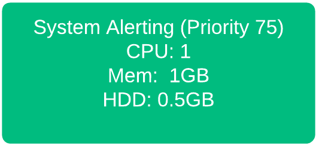
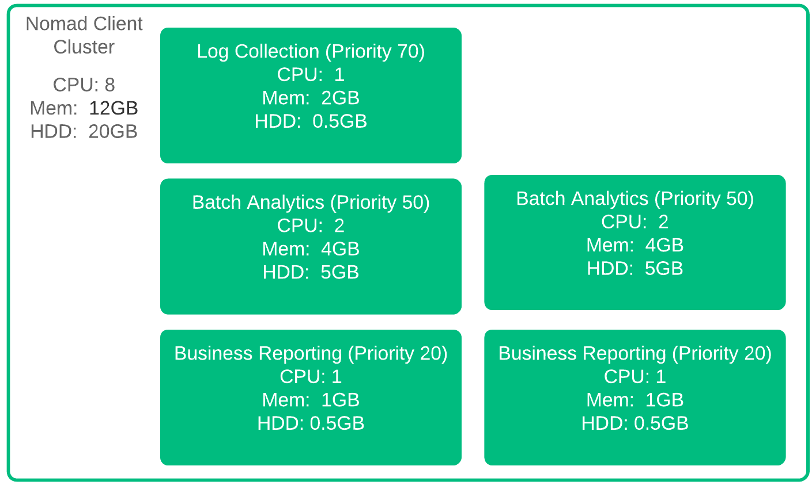
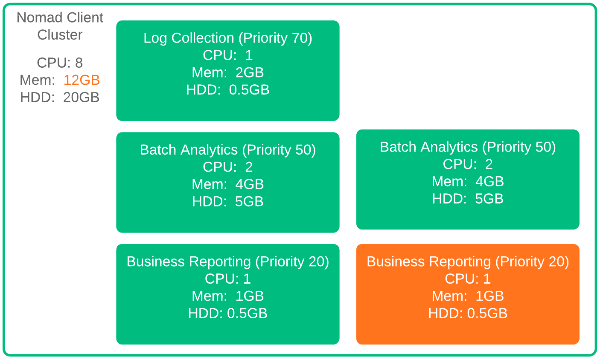
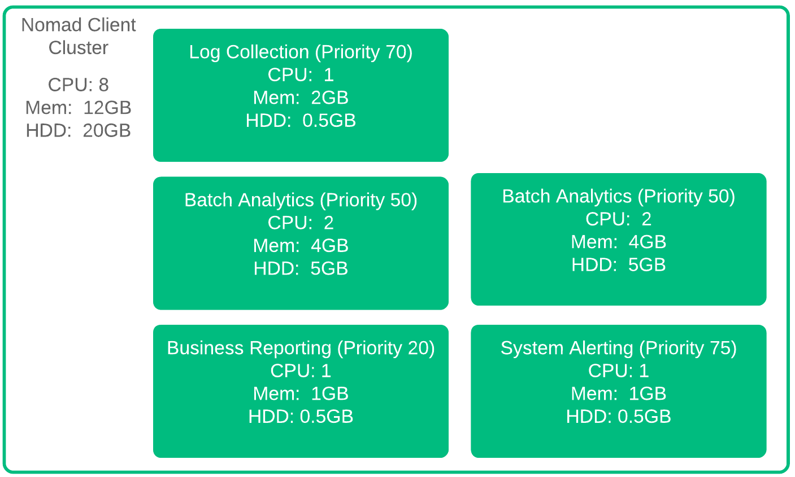
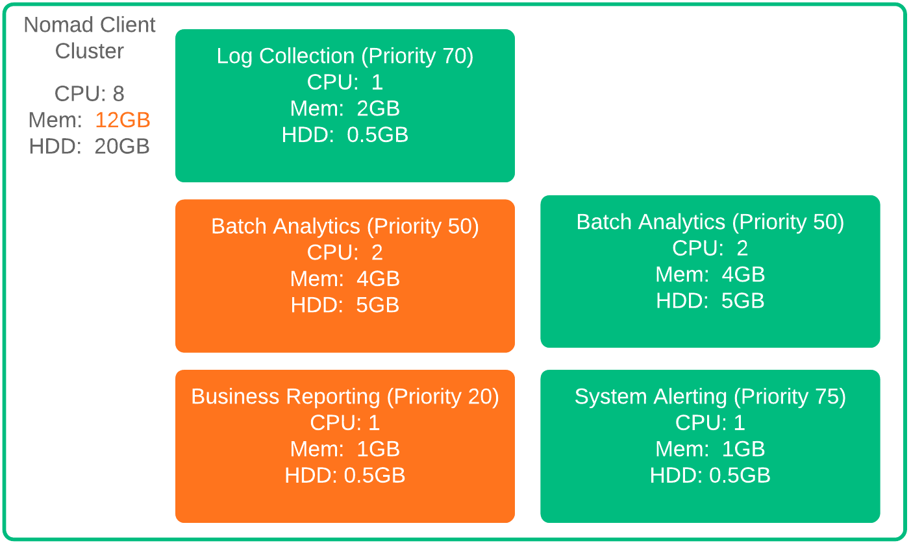
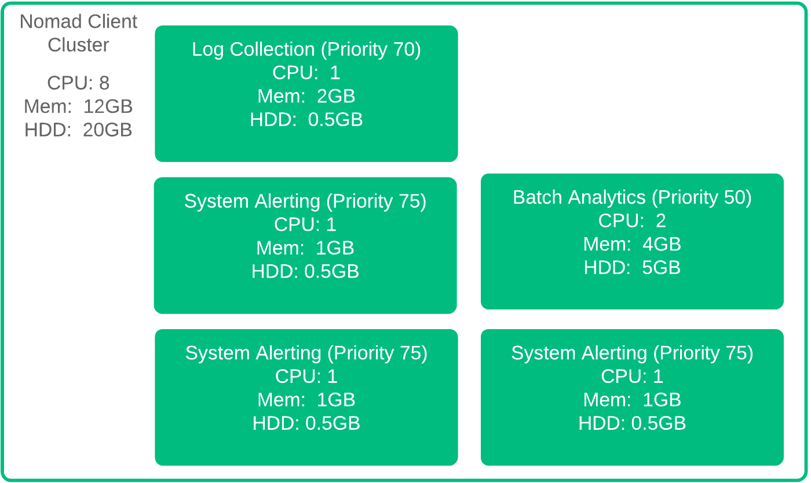

name: nomad-Preemption
class: title, shelf, no-footer, fullbleed
background-image: url(https://hashicorp.github.io/field-workshops-assets/assets/bkgs/HashiCorp-Title-bkg.jpeg)
count: false

# HashiCorp Nomad
## Preemption Details

???
The following slides go into the Preemption operation in more detail.

---
Name:  How Preemption Works
# Preemption Details

Need to add the System Alerting allocation, but there's no room!

.left-side[
  
]
.right-side[
  
]

???
Let's run through a quick example of how preemption works.  Here we have a Nomad cluster with a few allocations in an analytics solution.  Allocations are all happy, and now we have a new job added to the system for System Alerting.  We have enough CPU, and plenty of Hard Drive, but we are at the memory limit.  No room at the inn for our System Alerting process.  Without Preemption, that's where we would stop. But we have preemption, so we'll continue

---
Name:  How Preemption Works 2
# Preemption Details 2

One of the Business Reporting allocations needs to go!
.left-side[
  
]
.right-side[
  
]

???
With Preemption, Nomad realizes that there are lower priority allocations that can be evicted.  So if we are adding one System Alerting job, we evict one Business Reporting Job.  The Business Reporting job has the lowest priority, so it gets evicted first.  But what happens if we have to add two more System Alerting allocations?

---
Name:  How Preemption Works 3
# Preemption Details 3

More System Alerting means more eviction. Log Collection isn't a candidate - priority delta < 10

.left-side[
  
]
.right-side[
  
]

???
If we add two more Sytem Alerting allocations, we need to bump a Batch Analytics Allocation as well. Evicting the Log Collection allocation would be sufficient, however, the Batch Analytics Allocation has a lower priority.  Additionally, as the priority difference between System Alerting and Log Collection is less than 10, the Log Collection allocation isn't a candidate for preemption with respect to System Alerting.
