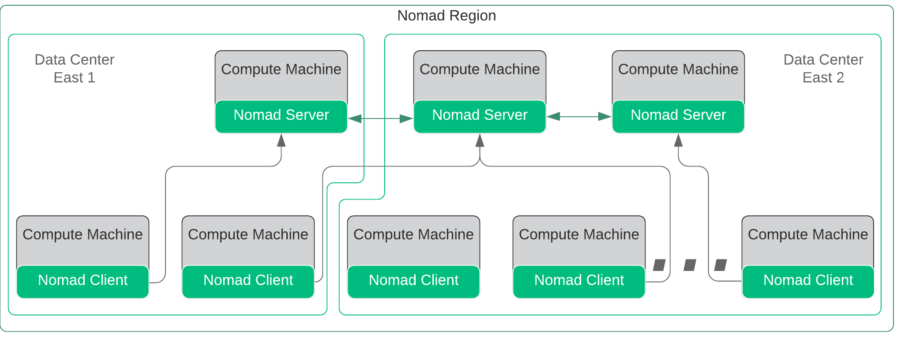
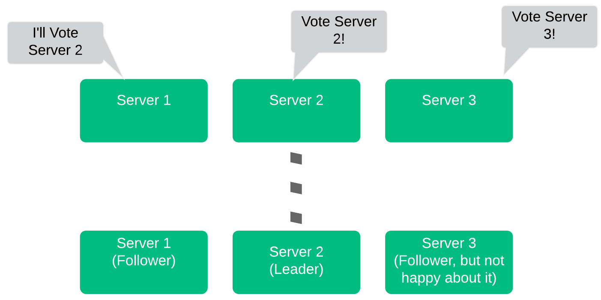
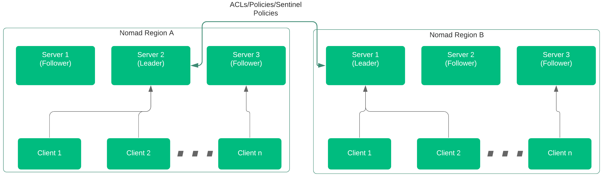
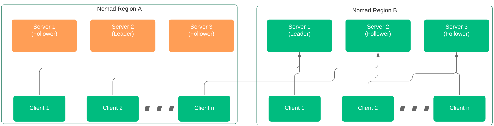
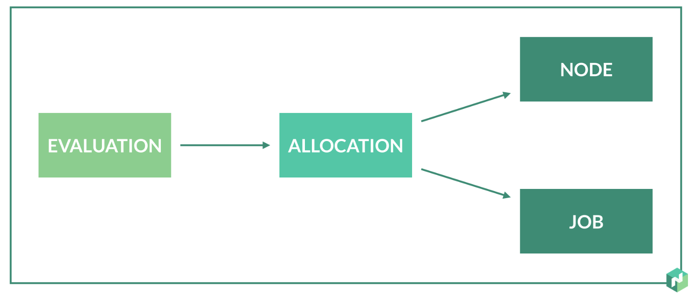
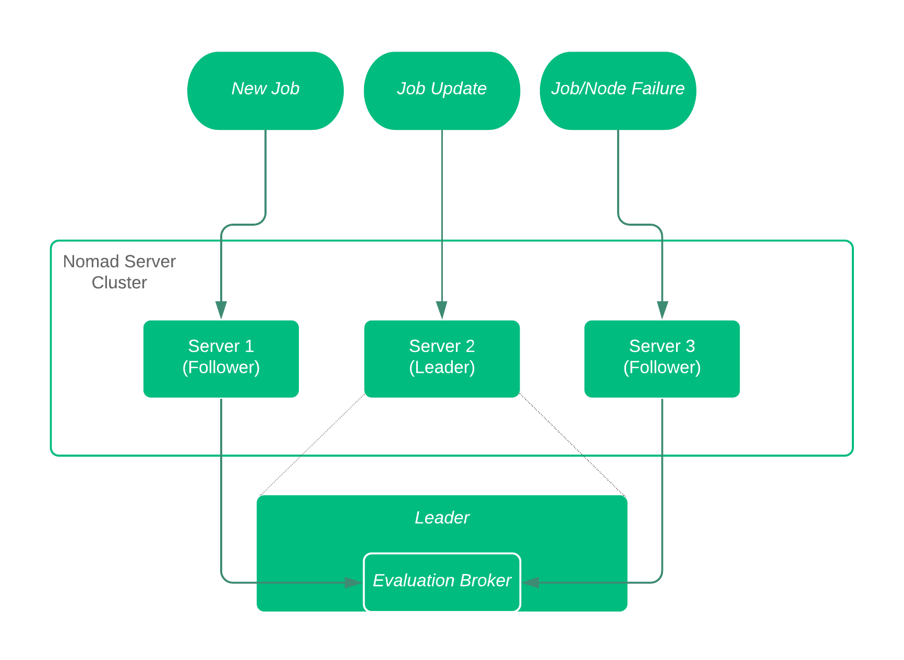
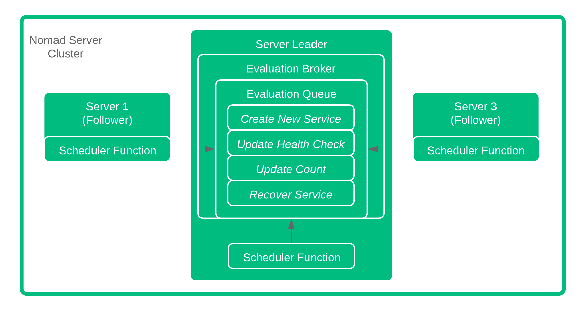
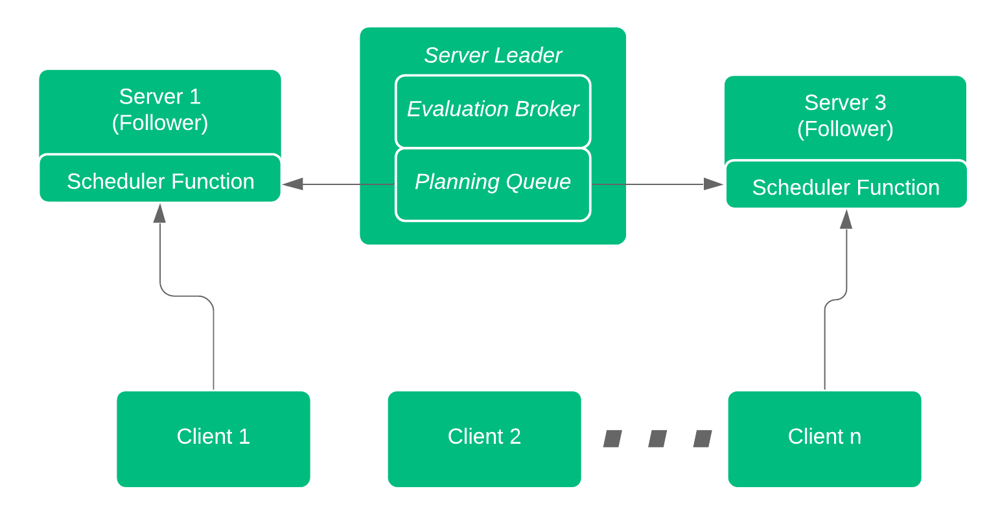
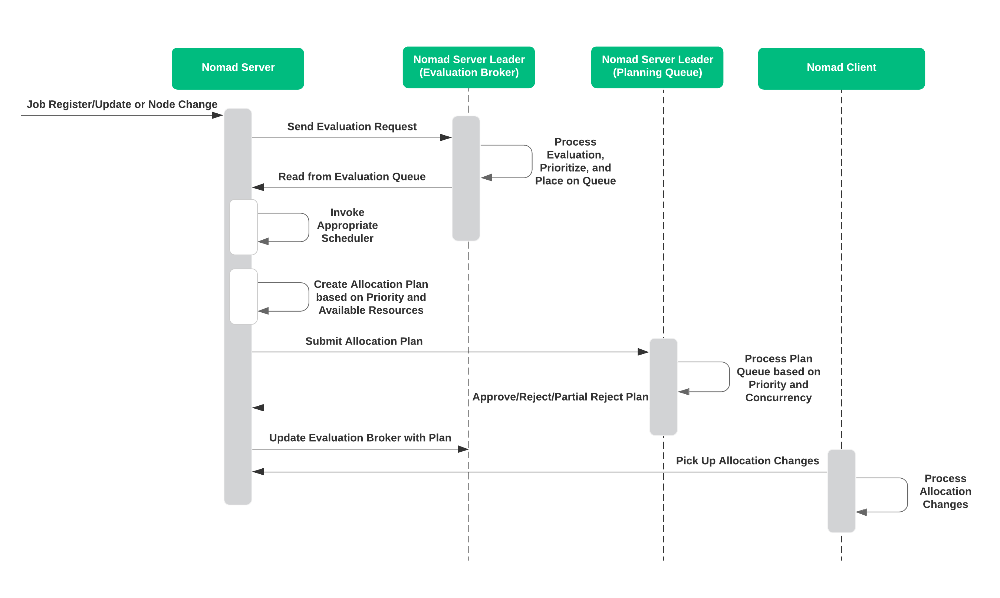

name: nomad-concepts
class: title, shelf, no-footer, fullbleed
background-image: url(https://hashicorp.github.io/field-workshops-assets/assets/bkgs/HashiCorp-Title-bkg.jpeg)
count: false

# HashiCorp Nomad
## Concepts and Architecture

???
Nomad is a highly advanced service scheduler and manager.  Within this slide deck, we'll be reviewing some of the more advanced concepts and architecture behind Nomad.

---
layout: true

.footer[
- Copyright © 2019 HashiCorp
- 
]

---
exclude: true

name: slides-link
# The Slide Show
## You can follow along on your own computer at this link:
### tbd

???
Here is a link to the slides so you can follow along, but please don't look ahead!

Hidden:  Custom diagrams can be found at Lucidchart
https://www.lucidchart.com/documents/edit/6cf954c6-16e9-4827-9d74-98417ba74444/0_0?beaconFlowId=D0003F1058D413A2

---
exclude: true

name:  Section Prerequisites
# Prerequisites
This deck assumes the following of the audience:
* Familiarity with Nomad Scheduler
* Familiarity working with HashiCorp Configuration Language
* A general understanding of container operations is recommended

???
This slide deck focuses on the concepts and architecture of Nomad.  Therefore the audience should have some basic understanding of the Nomad applications.

---
name:  What Is Nomad
# What is Nomad
.smaller[
* A flexible, lightweight, high performing, easy to use orchestrator
* Used to deploy and manage containers and legacy applications simultaneously
* Works across data centers and cloud platforms, providing universal scheduling
* Manages services, batch functions, as well as global system services
]

???
- Runs as a single binary in just about any environment - one of the easiest and lightweight service scheduler and manager available.
-  Used to deploy both container applications, as well as legacy applications such as Java or raw executables.
-  As an independent function, Nomad can run and communicate across data centers, and cloud platforms.  Truly cloud agnostic.
-  Can manage individual services, batch functions, or even global system services such as monitoring functions.

Nomad runs as a single binary in just about any environment, making it one of the easiest and lightweight service scheduler and manager available.  It can be used to deploy both container applications, as well as legacy applications such as Java or raw executables.  Being an independent function, Nomad can run and communicate across data centers, and cloud platforms.  Truly cloud agnostic.  Lastly, Nomad can manage individual services, batch functions, or even global system services such as monitoring functions.

---
name:  Common Nomad Terms
# Nomad Terms

.smaller[
* Nomad .bold[Clusters] consist of nodes running the Nomad binary, both Servers and Clients, in a single region
* .bold[Servers] provide the intelligence (scheduling, allocation) to the cluster
* .bold[Clients] register with the servers and execute scheduled tasks.
* .bold[Jobs] are submitted by users and represent the desired state of the associated workloads
* .bold[Drivers] are used by Nomad to execute tasks (i.e., Docker, Exec, Java, etc.)
* .bold[Tasks] are the smallest unit of work executed by drivers
* .bold[Task Groups] are groups of tasks (shocking) that must run together (cannot be split across clients)
]

???
-  Cluster contains anywhere from 3-5 server nodes, and an unconstrained number of client nodes.
-  All nodes run the same Nomad binary.
-  Nomad server nodes provide the brains and intelligence to the cluster, performing all scheduling and allocations
-  Clients execute the tasks as directed by the server cluster.
-  Jobs are used to describe the desired state of the workloads.
-  Drivers for docker containers, java apps, and arbitrary executables execute the defined tasks
-  Task Groups are groups of tasks that must be run together, often colocated on the same client -  may be required for various architectural reasons.

Nomad operates as clusters of nodes, with anywhere from 3-5 server nodes, and an unconstrained number of client nodes.  All nodes run the same Nomad binary.  The Nomad server nodes provide the brains and intelligence to the cluster, performing all scheduling and allocations, while the clients execute the tasks as directed by the server cluster. Jobs are used to describe the desired state of the workloads.  This is what the servers and clients work towards.  Nomad also offers drivers for docker containers, java apps, and arbitrary executables to help execute the defined tasks, getting the defined workloads into the desired state.  Task Groups are groups of tasks, as crazy as that may sound.  What is important here is that the task groups must be run together, often colocated on the same client, which may be required for various architectural reasons.

---
name:  More Nomad Terms
# Nomad Terms (part 2)

.smaller[
* .bold[Allocations] map the tasks and task groups within jobs to client nodes
* Nomad performs .bold[Evaluations] whenever jobs or client states change to determine if allocations must be adjusted
* Nomad maximizes resource utilization with a highly efficient .bold[Bin Packing] algorithm
* .bold[Datacenters] are physical or logical groups of compute resources typically defined by cloud service providers
* .bold[Regions] are Nomad logical constructs that may consist of multiple datacenters, and contain one Nomad cluster
* Multiple Nomad Regions can be .bold[Federated] together
]

???
-  Allocations map tasks, task groups, and jobs to various client resources.
-  Allocations are adjusted based on Nomad Evaluations that are performed whenever balance within the system is disrupted, either through adjustments to the job, and/or changes to the client availability.
-  Nomad uses a highly efficient bin packing algorithm to ensure that resource utilization is maximized across the client cluster.
-  A cluster can reside within a traditional datacenter, or across multipledata centers defined as a Nomad region.
- Regions can be federated together enabling wider communication without replicating data across all regions.

As we discuss Nomad, there are other concepts and terms to be aware of. Nomad's main job is to perform Allocations, mapping tasks, task groups, and jobs to various client resources.  These allocations are adjusted based on Nomad Evaluations that are performed whenever balance within the system is disrupted, either through adjustments to the job, and/or changes to the client availability. As evaluations and allocations are performed, Nomad uses a highly efficient bin packing algorithm to ensure that resource utilization is maximized across the client cluster.  That cluster can consist of client nodes residing within a traditional datacenter, or across multipledata centers defined as a Nomad region.  Nomad Regions and be federated together enabling wider communication without replicating data across all regions.

---
name:  Deployment Architecture
# Typical Deployment Architecture

.smaller[
* Single binary provides both Client and Server function
* 3-5 Servers per Nomad Cluster
* Servers elect 'Leader' to manage priorities, evaluations, and allocations
* Clusters can transcend Data Centers
]
.center[]

???
-  Nomad utilizes a single binary application that can be run as a client or server.
-  A server cluster should utilize 3-5 server nodes.
-  Servers communicate via the Gossip protocol, and use Consensus protocol to elect a leader
-  A single cluster of servers operate in a single region, which may consist of one or more data centers.

Nomad utilizes a single binary application that can be run as a client or server.  It is recommended that the server cluster utilize 3-5 server nodes.  The servers communicate via the Gossip protocol, and use Consensus protocol to elect a leader.  A single cluster of servers operate in a single region, which may consist of one or more data centers.

---
name:  Nomad Cluster Leader Election and Viability
# Cluster Leader Election and Viability
.smaller.left-side[
* Servers race to claim candidacy
* Server 2 announced first, asked for vote
* Server 1 heard server 2 first, and voted for server 2
* Server 3 lost, becomes follower
* Server 1 becomes the elected leader of the region
]
.right-side[

]

.smaller.center[Note:  3 Servers can sustain 1 Failure, 5 servers can sustain 2 failures]

???
-  When servers initialize, they need to find eachother and create a leader.
-  A server will promote itself as a candidate to be a leader, and notify the other servers in the cluster.
-  Once the candidate has a quorum of votes, it will promote itself as the leader.
-  With 3 server nodes, the cluster can sustain a single failure.  With 5 server nodes, the cluster can sustain two failures.
-  Note that as you increase server members, it will take longer for the consensus protocol to converge and elect a leader.

When servers initialize, they need to find eachother and create a leader.  A server will promote itself as a candidate to be a leader, and notify the other servers in the cluster.  Once the candidate has a quorum of votes, it will promote itself as the leader.  With 3 server nodes, the cluster can sustain a single failure.  With 5 server nodes, the cluster can sustain two failures.  Note that as you increase server members, it will take longer for the consensus protocol to converge and elect a leader.

---
name:  Multi-region Federation
# Operating Across Regions

.smaller[
* Multiple Nomad Regions can be Federated Together
* Jobs are submitted within region, and can be submitted across regions
* ACL Tokens, Policies, and Sentinel Policies are shared across regions - Application/State Data NOT Shared
]

.center[]

???
- Clusters can federate across regions using WAN Gossip
- Only ACL, Policies, and Sentinel Policies are shared across regions (no application data).

---
name:  Multi-region Federation
# Region Server Failure

.smaller[
* If all servers in a region fail, clients can access servers in a federated region
* Servers must be discoverable
* Requires RPC and Raft across Regions
]

.center[]

???
-  If the server cluster in one region goes down completely, the server cluster in another region can facilitate management.
-  This multi-region federation requires RPC and Serf support across regions.

---
Name:  Nomad Layout and Comms
# Nomad Communications
.left-side[
* 3-5 Server Nodes
* The Leader Replicates to Followers
* Followers forward Client Data and Requests to Leader
* Servers send Allocations to clients
* Clients Communicate with all Servers over RPC
]
.right-side[

]

???
-  Within the Server Cluster, we have a Leader, and we have Followers.
-  Leaders are elected via quorum (which is why it is important to have 3-5 nodes) using Consensus, based on RAFT.
-  Leader of the servers makes all allocation decisions, and distributes to Followers.
-  Server push allocation and task assignments via RPC to each Server.

Let's jump right in with the communications among the Nomad nodes.  Within the Server Cluster, we have a Leader, and we have Followers.  The Leaders are elected via quorum (which is why it is important to have 3-5 nodes) using the Consensus, based on RAFT.  The Leader of the servers makes all allocation decisions, and distributes to Followers.  Clients pull allocation and task assignments via RPC from each Server.

---
name: Nomad Scheduler Section
class: title, shelf, no-footer, fullbleed
background-image: url(https://hashicorp.github.io/field-workshops-assets/assets/bkgs/HashiCorp-Title-bkg.jpeg)
count: false

# Nomad Scheduler Processes
## Evaluations, Allocations, Priorities, and Preemption

???
Focusing more on the Scheduler process

---
Name:  Nomad Evaluation
# Nomad Scheduler Initiation - Evaluations
.left-side[
An Evaluation is "Kicked Off" whenever ANY of the following occur
.smaller[
* New Job Created
* Job Updated or Modified
* Job or Node Failure
]
]
.right-side[
    
]

???
-  Evaluations to determine if any work is necessary.
-  Evaluation is initiated by a new job definition, an updated job definition, or some change to the infrastructure.
-  If necessary, a new Allocation maps tasks or task groups within jobs, to the available nodes

Everything starts with something, regardless of your technical, moral, or spiritual beleifs.  With Nomad, we deal with Evaluations to determine if any work is necessary.  What kicks off that evaluation can be a new job definition, and updated job definition, or some change to the infrastructure.  If necessary, a new Allocation maps tasks or task groups within jobs, to the available nodes

---
Name:  Nomad Scheduler
# Nomad Scheduler Initiation
.left-side[

.smaller[
* Regardless of how the Evalution is initiated, the evaluation can be sent to any of the server nodes.
* All Evaluations are forwarded to the Evaluation Broker on the Leader
* Evaluation remains in 'pending' state until the Leader queues the process
]
]
.right-side[
    
]

???
-  A new job, a modified or updated job, or any change in the system (job or node failure) will cause an evaluation to kick off.
-  Any of the server nodes can receive the evaluation request.
-  Evaluations are forwarded to a dedicated process on the Leader, called the evaluation broker.
-  Evaluation remains in 'pending' state until broker decides upon allocation

A new job, a modified or updated job, or any change in the system (job or node failure) will cause an evaluation to kick off.  Regardless of how that's done, any of the server nodes can receive the evaluation request.  All evaluations are forwarded to a dedicated process on the Leader, called the evaluation broker.  Until the Evaluation broker can determine if an allocation is necessary, the evaluation remains in 'pending' state.

---
name:  Nomad Evaluation
# Nomad Evaluation
.left-side[
Once the Evaluation Broker recieves the Evaluations, the Broker queues the changes in order based on priority.

Scheduler on Follower Nodes pick the Evaluations off the queue and start planning!
]
.right-side[
    
]

???
-  Here the evaluation Broker, residing on the leader node, manages the queue of pending evaluations.
-  Priority is determined based on Job definition
-  Broker ensures that somebody picks up the evaluation for processing.
-  Once the evaluation is picked up by a Scheduler, the planning begins!

---
Name:  Scheduling Workers
# Scheduler Operations

All Servers run Scheduling Workers
* One Scheduler per CPU core by default
* Four Default Schedulers Available
    * .bold[Service] Scheduler optimized for long-lived services
    * .bold[Batch] Scheduler for fast placement of batch jobs
    * .bold[System] Scheduler for jobs to run on every node

???
-  Each server node runs one scheduler per CPU core.
-  Server chooses the proper scheduler, either for standard services, batch jobs, or system level jobs.

The Scheduling of the job is really the work that all sever nodes perform.  By default, each server node runs one scheduler per CPU core.  Depending on the job at hand, the Server chooses the proper scheduler, either for standard services, batch jobs, or system level jobs.

What if two server nodes pick off the same evaluation/job?  We'll get to that later.

---
Name:  Scheduler Function Part 2
# Scheduler Processing
Now that the Scheduler has the job, let's look at what the it does...
.smaller[
1.  Identify available resources/nodes to run the job
2.  Rank nodes based on bin packing and existing tasks/jobs
3.  Select highest ranking node, and create allocation plan
4.  Submit allocation plan to leader
]
???
-  Server process has several steps
-  First it identifies the potential nodes, or available resources, that could accept the job.
-  Next take a look at the ideal nodes, based on bin packing and existing tasks.
   -  Bin packing ensures the most efficient usage of the resources.
-  Taking existing tasks into account minimizes co-locating tasks on the same servers.
-  Highest ranking node is chosen, the allocation plan is created, and submitted back to the Leader.

Now that the Server node has picked off the job, there's a set of operations it has to run through.  First it identifies the potential nodes, or available resources, that could accept the job.  So ignore nodes that are out of resources, or no longer exist.  Next take a look at the ideal nodes, based on bin packing and existing tasks.  This is a very important step.  Bin packing ensures the most efficient usage of the resources.  Taking existing tasks into account minimizes co-locating tasks on the same servers.  Based on these factors, the highest ranking node is chosen, the allocation plan is created, and submitted back to the Leader.

---
Name:  Plan Queue Processing
# Plan Queue Processing
Back to the leader now...
.smaller.left-side[
5.  Evaluate all submitted allocation plans
6.  Accept, reject, or partially reject the plan
7.  Return response to Scheduler for implementation, rescheduling, or termination
8.  Scheduler updates status of evaluation and confirms with Evaluation Broker
9.  Clients pick up allocation changes and act!
]
.right-side[
    
]

???
-  Leader makes final determination for allocation.
-  All pending plans are prioritized and eliminate any concurrency if it exists.
-  Leader will either accept or reject (or partial reject) the plan.
-  Scheduler can chose to reschedule or terminate the request
-  Scheduler updates the Evaluation Broker with the decision, and clients pick up any changes deemed necessary

Now that the evaluations have been processed, and allocations proposed, it's back to the leader for the final determination.  This allows the all pending plans to be prioritized and eliminate any concurrency if it exists.  The leader will either accept or reject (or partial reject) the plan.  The Scheduler can chose to reschedule or terminate the request.  The Scheduler updates the Evaluation Broker with the decision, and clients pick up any changes deemed necessary

Question from before:  What if two server nodes pick off the same evaluation/job? This step manages that situation.  Multiple schedulers can pick up the same job and propose an allocation plan.  The Leader, with all of the plans, determines any overlap and rejects any duplicate or overlapping allocations.

---
Name:  End to End Flow
#  Flow Recap

---
Name:  Job Priority
# Job Priority
Every Scheduler, Planner, Program Managear, deals with struggling priorities.
.bold[Nomad] is no different - Priority is processed during evaluation and planning
.smaller[
* Every job has an associated Priority
* Priority ranges from 1-100
* Higher number = higher priority
]
What if higher priority jobs are scheduled?

???
-  Nomad supports priority configuration with every Job, from 1 to 100.
-  The higher the number, the higher the priority.
-  What if a higher priority job is scheduled and resources are limited?

We all struggle with priority.  Nomad supports priority configuration with every Job, from 1 to 100.  The higher the number, the higher the priority.  How does Nomad deal with the inevitable situation where a higher priority job is scheduled and resources are limited?  Preemption!

---
Name:  Preemption
# Preemption

Preemption allows Nomad to adjust resource allocations based on Job priority.

.left-side[
.smaller[
Without Preemption
* Jobs and tasks are allocated first come - first served
* Pending Evaluations not allocated until resources available
]
]

.right-side[
.smaller[
With Preemption
* Evaluations performed regardless of resource availability
* Lowest priority jobs evicted if necessary
* Output of 'Plan' identifies any preemptive actions
]
]

???
-  Jobs are evaluated and allocated as they are delivered to the evaluation broker.
-  If resources aren't avialable, any evaluations will be stuck in pending state until resources become available.
-  With preemption, Nomad evicts lowest priority jobs if necessary.
-  Any preemption actions necessary are highlighted as an output of the 'Plan' operation

Without any sort of preemption, jobs are evaluated and allocated as they are delivered to the evaluation broker.  If resources aren't avialable, any evaluations will be stuck in pending state until resources become available.  With preemption, Nomad continues to perform the evaluations and will evict lowest priority jobs if necessary.  Every 'plan' that is executed highlights any preemption actions necessary.

---
name: Nomad within HashiCorp
class: title, shelf, no-footer, fullbleed
background-image: url(https://hashicorp.github.io/field-workshops-assets/assets/bkgs/HashiCorp-Title-bkg.jpeg)
count: false

# Nomad Integrations
## The HashiCorp Ecosystem

???
Nomad integrates well with other HashiCorp products.  We're just going to touch on teh functionality here.

---
name: Nomad and HashiCorp
# Nomad and

???
Of course Terraform offers a provider for Nomad configuration and provisioning, but Nomad also works with both Consul and Vault.

---
name:  Nomad and Consul
# Connecting Nomad with Consul

.left-side[
.smaller[
* Automatic Clustering for Servers and Clients
* Service Discovery for Tasks and Jobs
* Dynamic Configuration for applications
* Secure communication between jobs and task groups using Consul Connect
]
]

.right-side[

]

???
-  Nomad Servers and Clients can automatically find each other within the network, minimizing configuration and being more address-flexible.
-  Consul enables application service nodes to be automatically discoverable within the cluster
-  Configuration files can be dynamically created utilizing environment variables or even Vault secrets with templating
-  Consul Connect can secure communication between services deployed in public or private clouds.

Using Consul's Service discovery, Nomad Servers and Clients can automatically find each other within the network, minimizing configuration and being more address-flexible.  Service Discovery can be used for more than just Nomad nodes.  As any orchestration or scheduling system operates, the mapping of services to nodes can change dynamically.  Using Consul enables application service nodes to be automatically discoverable within the cluster.  Using Consul Template, and the Nomad Template stanza, configuration files can be dynamically created utilizing environment variables or even Vault secrets. This is a very advanced topic.
Consul Connect can even be used to secure communication between services deployed in public or private clouds

---
name:  Nomad and Vault
# Security Nomad with Vault

* Generate Nomad API tokens on demand securing access to the Nomad Cluster
* Create and Distribute Vault tokens to be used by Tasks and Jobs
* Enable dynamic secrets for any services within the Nomad Cluster

???
-  Vault provides access authentication through the Nomad Secrets Engine.
-  Create and distribute tokens to be used by tasks and jobs to access external services.
-  Services within the Nomad cluster can utilize Vault to create dynamic credentials for service clients.

Vault provides a great deal of security features, and bringing them into Nomad extends your security portfolio to the microservices domain.  For access to the Nomad Cluster, Vault can provide authentication through the Nomad Secrets Engine.  Additionally, Vault can create and distribute tokens to be used by tasks and jobs to access external services.  Furthermore,  services within the Nomad cluster can utilize Vault to create dynamic credentials for service clients.