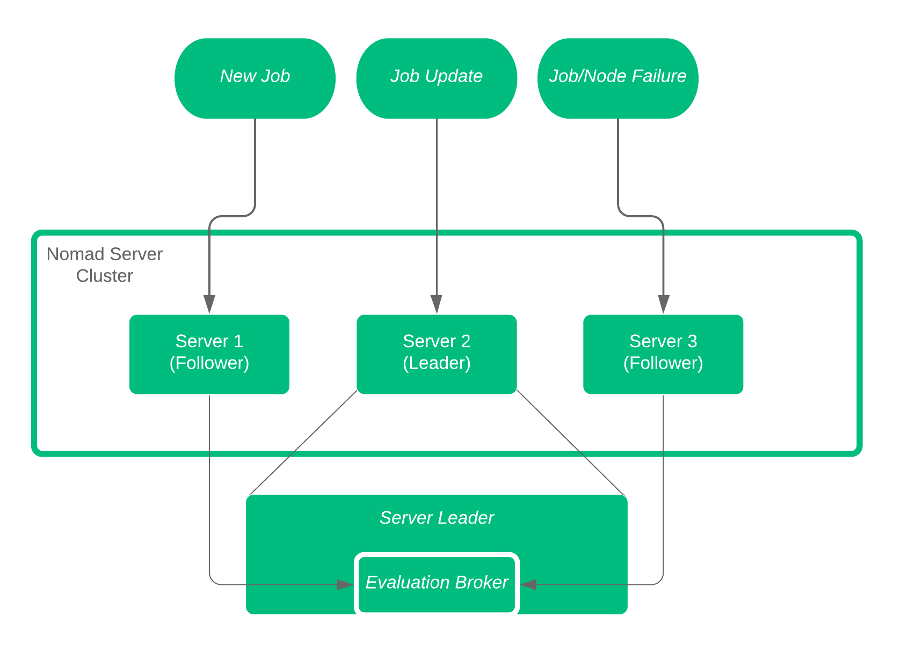

name: nomad-concepts
class: title, shelf, no-footer, fullbleed
background-image: url(https://hashicorp.github.io/field-workshops-assets/assets/bkgs/HashiCorp-Title-bkg.jpeg)
count: false

# HashiCorp Nomad
## Advanced Concepts and Architecture

???
Nomad is a highly advanced service scheduler and manager.  Within this slide deck, we'll be reviewing some of the more advanced concepts and architecture behind Nomad.

---
layout: true

.footer[
- Copyright © 2019 HashiCorp
- 
]

---
name: slides-link
# The Slide Show
## You can follow along on your own computer at this link:
### tbd

???
Here is a link to the slides so you can follow along, but please don't look ahead!

Hidden:  Custom diagrams can be found at Lucidchart
https://www.lucidchart.com/documents/edit/6cf954c6-16e9-4827-9d74-98417ba74444/0_0?beaconFlowId=D0003F1058D413A2

---
name:  Section Prerequisites
# Prerequisites
This deck assumes the following of the audience:
* Familiarity with Nomad Scheduler
* Familiarity working with HashiCorp Configuration Language
* A general understanding of container operations is recommended

???
This slide deck focuses on the concepts and architecture of Nomad.  Therefore the audience should have some basic understanding of the Nomad applications.

---
name:  High level Nomad Review
# Nomad Review
Let's review a few high level concepts about Nomad:
.smaller[
* Nomad is a flexible, lightweight, performance, easy to use orchestrator
* Nomad is used to deploy and manage containers and legacy applications simultaneously
* Nomad works across data centers and cloud platforms, providing universal scheduling
* Nomad manages services, batch functions, as well as global system services
]

???
Nomad runs as a single binary in just about any environment, making it one of the easiest and lightweight service scheduler and manager available.  It can be used to deploy both container applications, as well as legacy applications such as Java or raw executables.  Being an independent function, Nomad can run and communicate across data centers, and cloud platforms.  Truly cloud agnostic.  Lastly, Nomad can manage individual services, batch functions, or even global system services such as monitoring functions.

---
name:  Common Nomad Terms
# Nomad Terms
Let's review some terms and definitions regarding Nomad

.smaller[
* Nomad clusters consist of nodes running the Nomad binary, both Servers and Clients
* Servers provide the intelligence (scheduling, allocation) to the cluster
* Clients run the Nomad agent which registers with the server and executes local tasks.
* Jobs are submitted by users and represent the desired state of the associated workloads
* Drivers are used by Nomad to execute tasks (i.e., Docker, QEMU, Java, etc.)
* Tasks are the smallest unit of work executed by task drivers
]

???
Nomad operates as clusters of nodes, with anywhere from 3-5 server nodes, and an unconstrained number of client nodes.  All nodes run the same Nomad binary.  The Nomad server nodes provide the brains and intelligence to the cluster, performing all scheduling and allocations, while the clients execute the tasks as directed by the server cluster. Jobs are used to describe the desired state of the workloads.  This is what the servers and clients work towards.  Nomad also offers several drivers to help execute the defined tasks, getting the defined workloads into the desired state.

---
Name:  Nomad Layout and Comms
# Nomad Communications
.left-side[
* 3-5 Server Nodes
* Server Leaders Replicate to Followers
* Server Followers Send Request and Allocations to Server
* Clients Communicate with Servers over RPC
]
.right-side[
    
]

???
Let's jump right in with the communications among the Nomad nodes.  Within the Server Cluster, we have a Leader, and we have Followers.  The Leaders are elected via quorum (which is why it is important to have 3-5 nodes) using the Consensus, based on RAFT.  The Leader of the servers makes all allocation decisions, and distributes to Followers.  Clients pull allocation and task assignments via RPC from each Server.

---
Name:  Nomad Scheduler
# Nomad Scheduler Initiation
.left-side[
An Evaluation is "Kicked Off"
.smaller[
* New Job
* Job Update
* Job or Node Failure
]
An Evaluation can be sent to any of the Server nodes, but eventually they all make it to the Evaluation broker that resides on the leader.  Until queued, the evaluation is in 'pending' state
]
.right-side[
    
]

???
Everything starts with something, regardless of your technical, moral, or spiritual beleifs.  With Nomad, we deal witih Evaluations to determine if any work is necessary.  What kicks off that evaluation can be a new job definition, and updated job definition, or some change to the infrastructure.

---
name:  Nomad Evaluation
# Nomad Evaluation
.left-side[
Once the Evaluation Broker recieves the evaluations, the Broker queues the changes in order based on prirority.

Scheduler on Follower Nodes pick off the queue and start planning!
]
.right-side[
    
]

???
We're talking about Evaluation, not Evolution. Here the evaluation Broker, residing on the leader node, manages the queue of pending evaluations.  Priority is determined based on Job definition, and the Broker ensures that somebody picks up the evaluation for processing.  Once the evaluation is picked up by a Scheduler, the planning begins!

---
Name:  Scheduler Function
# Scheduler Operations

All Servers run Scheduling Functions
* One Scheduler per CPU core by default
* Four Default Schedulers Available
    * Service Scheduler optimized for long-lived services
    * Batch Scheduler for fast placement of batch jobs
    * System Scheduler for jobs to run on every node
    * Core Scheduler for Internal Purposes Only

???
The Scheduling of the job is really the work that all sever nodes perform.  By default, each server node runs one scheduler per CPU core.  Depending on the job at hand, the Server chooses the proper scheduler, either for standard services, batch jobs, system level jobs, or internal jobs.

What if two server nodes pick off the same evaluation/job?  We'll get to that later.

---
Name:  Scheduler Function Part 2
# Scheduler Processing
Now that the Scheduler has the job, let's look at what the it does...
.smaller[
1.  Identify available resources/nodes to run the job
2.  Rank resources based on bin packing and existing tasks/jobs
3.  Select highest ranking node, and create allocation plan
4.  Submit allocation plan to leader
]
???
Now that the Server node has picked off the job, there's a set of operations it has to run through.  First it identifies the potential nodes, or available resources, that could accept the job.  So ignore nodes that are out of resources, or no longer exist.  Next take a look at the ideal nodes, based on bin packing and existing tasks.  This is a very important step.  Bin packing ensures the most efficient usage of the resources.  Taking existing tasks into account minimizes co-locating tasks on the same servers.  Based on these factors, the highest ranking node is chosen, the allocation plan is created, and submitted back to the Leader.

---
Name:  Plan Queue Processing
# Plan Queue Processing
Back to the leader now...
.smaller.left-side[
5.  Evaluate all submitted allocation plans
6.  Accept, reject, or partially reject the plan
7.  Return response to Scheduler for implementation, reschedule, or terminate
8.  Scheduler Updates status of evaluation and confirms with Evaluation Broker
9.  Clients pick up allocation changes and act!
]
.right-side[
    
]

???
Now that the evaluations have been processed, and allocations proposed, it's back to the leader for the final determination.  This allows the all pending plans to be prioritized and eliminate any concurrency if it exists.  The leader will either accept or reject (or partial reject) the plan.  The Scheduler can chose to reschedule or terminate the request.  The Scheduler updates the Evaluation Broker with the decision, and clients pick up any changes deemed necessary

Question from before:  What if two server nodes pick off the same evaluation/job? This step manages that situation.  Multiple schedulers can pick up the same job and propose an allocation plan.  The Leader, with all of the plans, determines any overlap and rejects any duplicate or overlapping allocations.

---
Name:  End to End Flow
#  Flow Recap

---
Name:  A Focus on Priority
# Let's Talk Priority
Priority Processed During Evaluation and Planning

What if higher priority jobs are scheduled?

.larger[PREEMPTION]

???
We all struggle with priority.  How does Nomad deal with the inevitable situation where a higher priority job is scheduled and resources are limited?  Preemption!
---
Name:  Preemption
# Preemption

Preemption allows Nomad to ensure higher priority (based on Job definition) are scheduled first.

.smaller[
* Occurs only when resources are constrained
* Only jobs with a priority delta > 10 evaluated
* Lowest priority jobs evicted first
* Output of 'Plan' identifies any preemptive actions
]