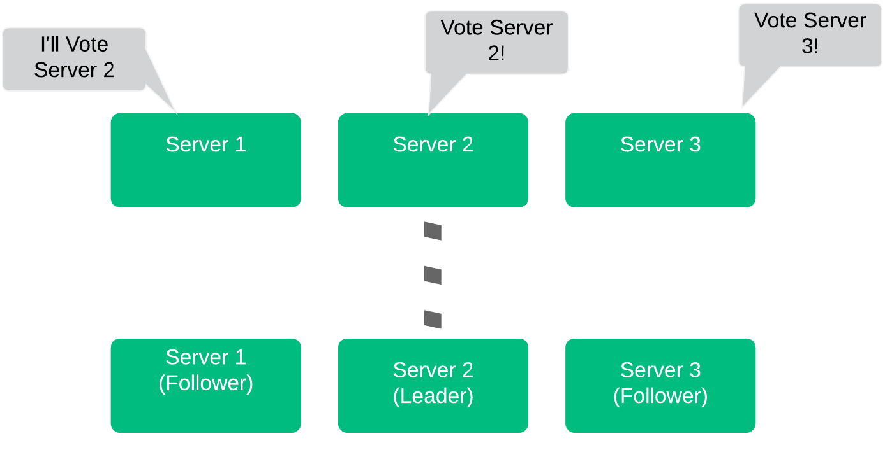
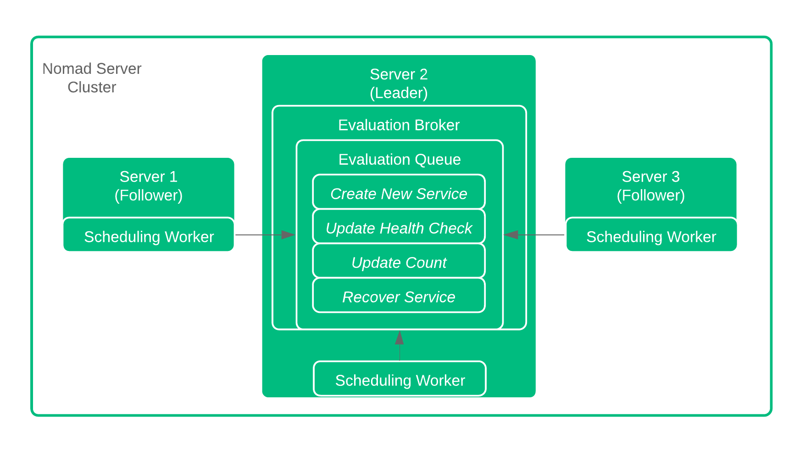
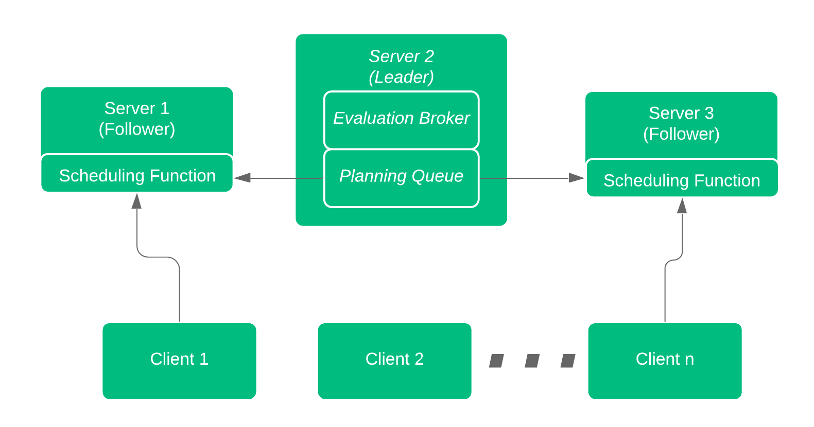
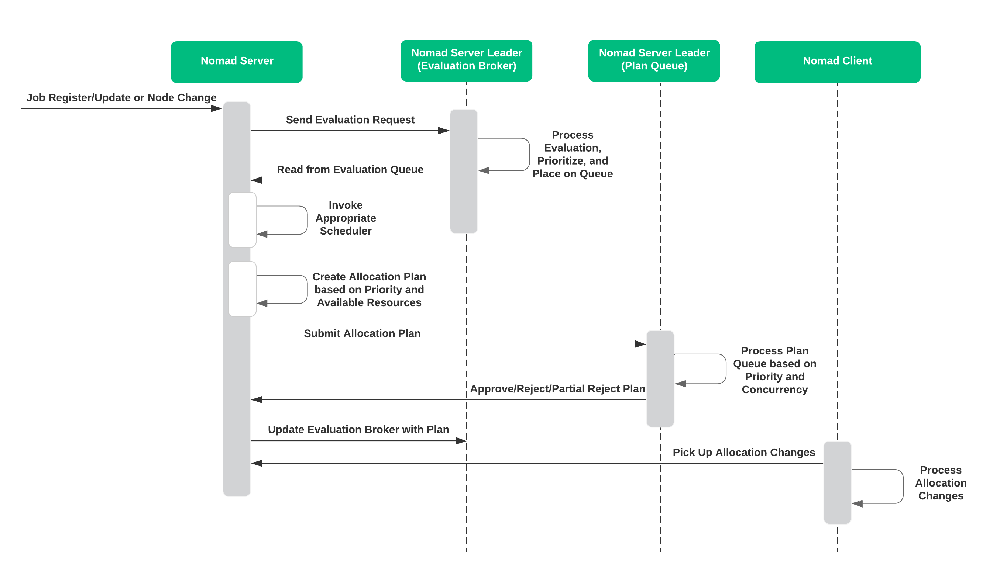
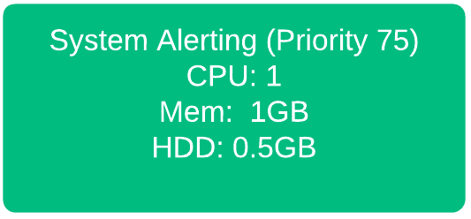
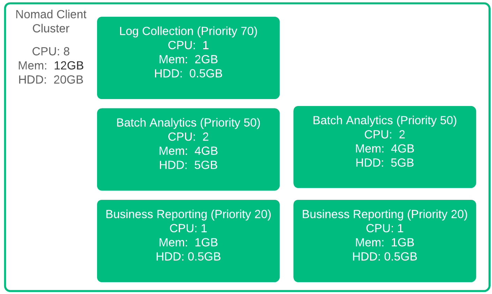
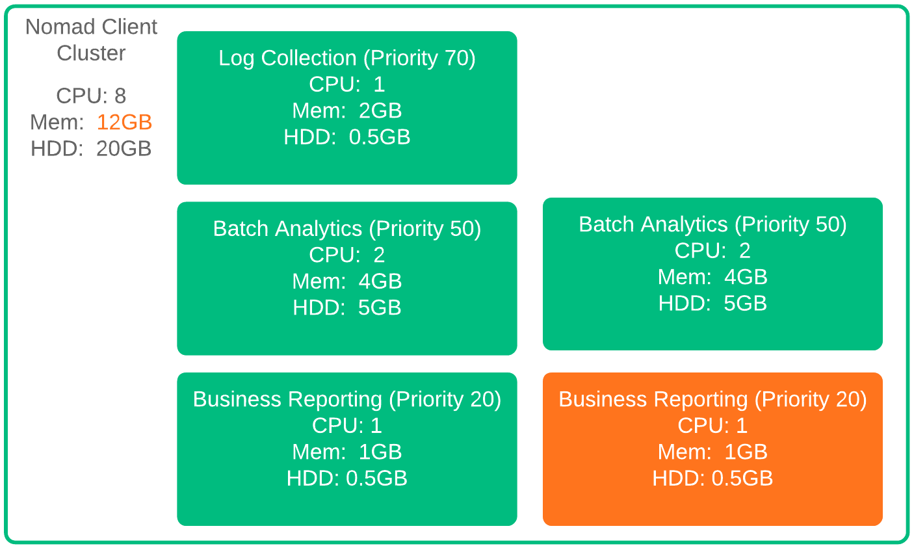
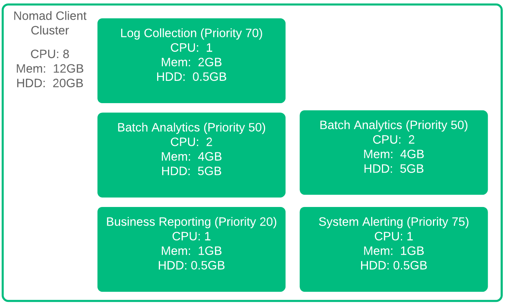
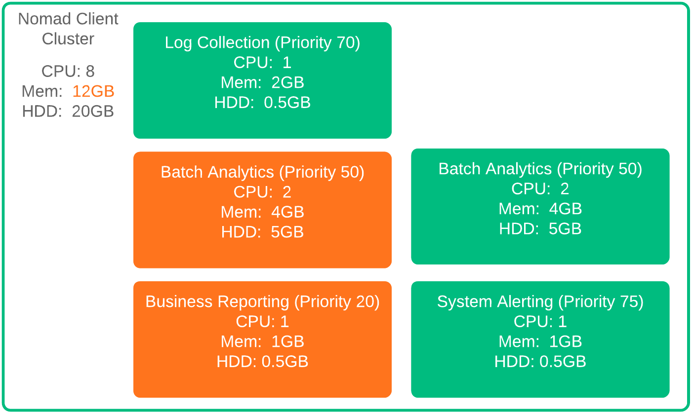
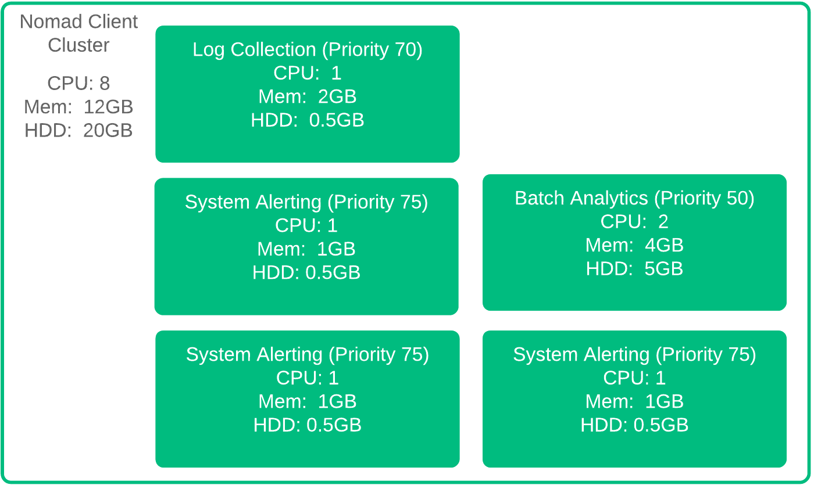

name: nomad-concepts
class: title, shelf, no-footer, fullbleed
background-image: url(https://hashicorp.github.io/field-workshops-assets/assets/bkgs/HashiCorp-Title-bkg.jpeg)
count: false

# HashiCorp Nomad
## Concepts and Architecture

???
Nomad is a highly advanced service scheduler and manager.  Within this slide deck, we'll be reviewing some of the more advanced concepts and architecture behind Nomad.

---
layout: true

.footer[
- Copyright © 2019 HashiCorp
- 
]

---
exclude: true

name: slides-link
# The Slide Show
## You can follow along on your own computer at this link:
### tbd

???
Here is a link to the slides so you can follow along, but please don't look ahead!

Hidden:  Custom diagrams can be found at Lucidchart
https://www.lucidchart.com/documents/edit/6cf954c6-16e9-4827-9d74-98417ba74444/0_0?beaconFlowId=D0003F1058D413A2

---
exclude: true

name:  Section Prerequisites
# Prerequisites
This deck assumes the following of the audience:
* Familiarity with Nomad Scheduler
* Familiarity working with HashiCorp Configuration Language
* A general understanding of container operations is recommended

???
This slide deck focuses on the concepts and architecture of Nomad.  Therefore the audience should have some basic understanding of the Nomad applications.

---
name:  What Is Nomad
# What is Nomad
.smaller[
* A flexible, lightweight, high performing, easy to use orchestrator
* Used to deploy and manage containers and legacy applications simultaneously
* Works across data centers and cloud platforms, providing universal scheduling
* Manages services, batch functions, as well as global system services
]

???
Nomad runs as a single binary in just about any environment, making it one of the easiest and lightweight service scheduler and manager available.  It can be used to deploy both container applications, as well as legacy applications such as Java or raw executables.  Being an independent function, Nomad can run and communicate across data centers, and cloud platforms.  Truly cloud agnostic.  Lastly, Nomad can manage individual services, batch functions, or even global system services such as monitoring functions.

---
name:  Common Nomad Terms
# Nomad Terms
Let's review some terms and definitions regarding Nomad

.smaller[
* Nomad .bold[Clusters] consist of nodes running the Nomad binary, both Servers and Clients
* .bold[Servers] provide the intelligence (scheduling, allocation) to the cluster
* .bold[Clients] run the Nomad agent which registers with the server and executes local tasks.
* .bold[Jobs] are submitted by users and represent the desired state of the associated workloads
* .bold[Drivers] are used by Nomad to execute tasks (i.e., Docker, Exec, Java, etc.)
* .bold[Tasks] are the smallest unit of work executed by task drivers
]

???
Nomad operates as clusters of nodes, with anywhere from 3-5 server nodes, and an unconstrained number of client nodes.  All nodes run the same Nomad binary.  The Nomad server nodes provide the brains and intelligence to the cluster, performing all scheduling and allocations, while the clients execute the tasks as directed by the server cluster. Jobs are used to describe the desired state of the workloads.  This is what the servers and clients work towards.  Nomad also offers drivers for docker containers, java apps, and arbitrary executables to help execute the defined tasks, getting the defined workloads into the desired state.

---
name:  More Nomad Terms
# Nomad Terms (part 2)

.smaller[
* .bold[Task Groups] are groups of tasks (shocking) that must run together (can not be split across clients)
* .bold[Allocations] are created by Nomad servers to map tasks, task groups, and jobs to client machines
* Nomad performs .bold[Evaluations] whenever jobs or client states change to determine if allocations must be adjusted
* Nomad maximizes resource utilization with a highly efficient .bold[Bin Packing] algorithm
* .bold[Data Centers] are physical or logical groups of compute resources typically defined by cloud service providers
* .bold[Regions] are Nomad logical constructs that may consist of multiple data centers enabling federation across client pools.
]

???
As we discuss Nomad, there are other concepts and terms to be aware of.  Task Groups are groups of tasks, as crazy as that may sound.  What is important here is that the task groups must be run together, often colocated on the same client, which may be required for various architectural reasons.  Nomad's main job is to perform Allocations, mapping tasks, task groups, and jobs to various client resources.  These allocations are adjusted based on Nomad Evaluations that are performed whenever balance within the system is disrupted, either through adjustments to the job, and/or changes to the client availability. As evaluations and allocations are performed, Nomad uses a highly efficient bin packing algorithm to ensure that resource utilization is maximized across the client cluster.  That cluster can consist of client nodes residing within a traditional data center, or across multiple data centers defined as a Nomad region.  Utilizing regions enables service federation across multiple cloud providers or geographic areas without replicating data across all regions.

---
name:  Deployment Architecture
# Typical Deployment Architecture

.smaller[
* Single binary provides both Client and Server function
* 3-5 Servers per Nomad Cluster
* Servers elect 'Leader' to manage priorities, evaluations, and allocations
* Clusters can transcend Data Centers
]
.center[]

???
Nomad utilizes a single binary application that can be run as a client or server.  It is recommended that the server cluster utilize 3-5 server nodes.  The servers communicate via the Gossip protocol, and use Consensus protocol to elect a leader.  A single cluster of servers operate in a single region, which may consist of one or more data centers.

---
name:  Nomad Server Leader Election
# Server Cluster Initialization

.smaller.left-side[
* Servers race to claim candidacy
* Server 2 announced first, asked for vote
* Server 1 heard server 2 first, and voted
* Server 3 lost, becomes follower
* 3 Servers sustains 1 Failure, 5 servers sustains 2 failures
]
.right-side[

]

???
When servers initialize, they need to find eachother and create a leader.  A server will promote itself as a candidate to be a leader, and notify the other servers in the cluster.  Once the candidate has a quorum of votes, it will promote itself as the leader.  With 3 server nodes, the cluster can sustain a single failure.  With 5 server nodes, the cluster can sustain two failures.  Note that as you increase server members, it will take longer for the consensus protocol to converge and elect a leader.

---
name:  Multi-region Federation
# Operating Across Regions

.smaller[
* Cluster can Operate Across Regions
* Synchronizes ACLs, Policies, Sentinel Policies
* Application/State Data NOT Shared
]

.center[]

???
Clusters can operate across regions using WAN Gossip. Only ACL, Policies, and Sentinel Policies are shared across regions (no application data).

---
name:  Multi-region Federation
# Region Server Failure

.smaller[
* In case of Failure, clients can access servers in another region
* Servers must be discoverable
* Requires RPC and Raft across Regions
]

.center[]

???
If the server cluster in one region goes down completely, the server cluster in another region can facilitate management.  This multi-region federation requires RPC and Serf support across regions.

---
Name:  Nomad Layout and Comms
# Nomad Communications
.left-side[
* 3-5 Server Nodes
* The Leader Replicates to Followers
* Followers forward Allocations, Client Data, and Requests to Leader
* Clients Communicate with all Servers over RPC
]
.right-side[

]

???
Let's jump right in with the communications among the Nomad nodes.  Within the Server Cluster, we have a Leader, and we have Followers.  The Leaders are elected via quorum (which is why it is important to have 3-5 nodes) using the Consensus, based on RAFT.  The Leader of the servers makes all allocation decisions, and distributes to Followers.  Clients pull allocation and task assignments via RPC from each Server.

---
name:  Nomad transaction management
# Client Transaction Flow

Working

???
As the clients communicate with the servers, transactions are shared across all servers within the cluster.  The transactions are durable, meaning at least a majority of servers need to acknowledge the transaction before a response is sent back to the client.

---
name:  Client Initialization and Discovery
# Nomad Node Discovery
Nomad...
* Servers must be accessible - IP, FQDN, or Discovery
* Clients must reach servers - IP, FQDN, or Discovery
* Regions must reach other Regions for Federation

Through IP Address, FQDN, or Discovery

???
As Clients are initialized, they reach out to the configured servers, either by IP address, FQDN, or preferrably through some service discovery (Consul).

---
name:  Nomad with Consul
# Nomad with Consul Discovery

working

???

---
Name:  Nomad Scheduler Section
# Nomad Scheduler Processes
## Evaluations, Allocations, Priorities, and Preemption

---
Name:  Nomad Evaluation
# Nomad Scheduler Initiation - Evaluations
.left-side[
An Evaluation is "Kicked Off" whenever ANY of the following occur
.smaller[
* New Job Created
* Job Updated or Modified
* Job or Node Failure
]
]
.right-side[
    
]

???
Everything starts with something, regardless of your technical, moral, or spiritual beleifs.  With Nomad, we deal witih Evaluations to determine if any work is necessary.  What kicks off that evaluation can be a new job definition, and updated job definition, or some change to the infrastructure.  If necessary, a new Allocation maps tasks or task groups within jobs, to the available nodes

---
Name:  Nomad Scheduler
# Nomad Scheduler Initiation
.left-side[

.smaller[
* Regardless of how the Evalution is initiated, the evaluation can be sent to any of the server nodes.
* All Evaluations are forwarded to the Evaluation Broker on the Leader
* Evaluation remains in 'pending' state until the Leader queues the process
]
]
.right-side[
    
]

???
A new job, a modified or updated job, or any change in the system (job or node failure) will cause an evaluation to kick off.  Regardless of how that's done, any of the server nodes can receive the evaluation request.  All evaluations are forwarded to a dedicated process on the Leader, called the evaluation broker.  Until the Evaluation broker can determine if an allocation is necessary, the evaluation remains in 'pending' state.

---
name:  Nomad Evaluation
# Nomad Evaluation
.left-side[
Once the Evaluation Broker recieves the Evaluations, the Broker queues the changes in order based on priority.

Scheduler on Follower Nodes pick the Evaluations off the queue and start planning!
]
.right-side[
    
]

???
We're talking about Evaluation, not Evolution. Here the evaluation Broker, residing on the leader node, manages the queue of pending evaluations.  Priority is determined based on Job definition, and the Broker ensures that somebody picks up the evaluation for processing.  Once the evaluation is picked up by a Scheduler, the planning begins!

---
Name:  Scheduling Workers
# Scheduler Operations

All Servers run Scheduling Workers
* One Scheduler per CPU core by default
* Four Default Schedulers Available
    * Service Scheduler optimized for long-lived services
    * Batch Scheduler for fast placement of batch jobs
    * System Scheduler for jobs to run on every node
    * Core Scheduler for Internal Purposes Only

???
The Scheduling of the job is really the work that all sever nodes perform.  By default, each server node runs one scheduler per CPU core.  Depending on the job at hand, the Server chooses the proper scheduler, either for standard services, batch jobs, system level jobs, or internal jobs.

What if two server nodes pick off the same evaluation/job?  We'll get to that later.

---
Name:  Scheduler Function Part 2
# Scheduler Processing
Now that the Scheduler has the job, let's look at what the it does...
.smaller[
1.  Identify available resources/nodes to run the job
2.  Rank resources based on bin packing and existing tasks/jobs
3.  Select highest ranking node, and create allocation plan
4.  Submit allocation plan to leader
]
???
Now that the Server node has picked off the job, there's a set of operations it has to run through.  First it identifies the potential nodes, or available resources, that could accept the job.  So ignore nodes that are out of resources, or no longer exist.  Next take a look at the ideal nodes, based on bin packing and existing tasks.  This is a very important step.  Bin packing ensures the most efficient usage of the resources.  Taking existing tasks into account minimizes co-locating tasks on the same servers.  Based on these factors, the highest ranking node is chosen, the allocation plan is created, and submitted back to the Leader.

---
Name:  Plan Queue Processing
# Plan Queue Processing
Back to the leader now...
.smaller.left-side[
5.  Evaluate all submitted allocation plans
6.  Accept, reject, or partially reject the plan
7.  Return response to Scheduler for implementation, rescheduling, or termination
8.  Scheduler updates status of evaluation and confirms with Evaluation Broker
9.  Clients pick up allocation changes and act!
]
.right-side[
    
]

???
Now that the evaluations have been processed, and allocations proposed, it's back to the leader for the final determination.  This allows the all pending plans to be prioritized and eliminate any concurrency if it exists.  The leader will either accept or reject (or partial reject) the plan.  The Scheduler can chose to reschedule or terminate the request.  The Scheduler updates the Evaluation Broker with the decision, and clients pick up any changes deemed necessary

Question from before:  What if two server nodes pick off the same evaluation/job? This step manages that situation.  Multiple schedulers can pick up the same job and propose an allocation plan.  The Leader, with all of the plans, determines any overlap and rejects any duplicate or overlapping allocations.

---
Name:  End to End Flow
#  Flow Recap

---
Name:  A Focus on Priority
# Let's Talk Priority
Every Scheduler, Planner, Program Managear, deals with struggling priorities.
.bold[Nomad] is no different - Priority is processed during evaluation and planning
.smaller[
* Every job has an associated Priority
* Priority ranges from 1-100 - higher number = higher priority
]
What if higher priority jobs are scheduled?

.larger.bold[PREEMPTION]

???
We all struggle with priority.  Nomad supports priority configuration with every Job, from 1 to 100.  The higher the number, the higher the priority.  How does Nomad deal with the inevitable situation where a higher priority job is scheduled and resources are limited?  Preemption!

---
Name:  Preemption
# Preemption

Preemption allows Nomad to adjust resource allocations based on Job priority.

.left-side[
.smaller[
Without Preemption
* Jobs and tasks are allocated first come - first served
* Pending Evaluations not allocated until resources available
]
]

.right-side[
.smaller[
With Preemption
* Evaluations performed regardless of resource availability
* Lowest priority jobs evicted if necessary
* Output of 'Plan' identifies any preemptive actions
]
]

???
Without any sort of preemption, jobs are evaluated and allocated as they are delivered to the evaluation broker.  If resources aren't avialable, any evaluations will be stuck in pending state until resources become available.  With preemption, Nomad continues to perform the evaluations and will evict lowest priority jobs if necessary.  Every 'plan' that is executed highlights any preemption actions necessary.

---
Name:  How Preemption Works
# Preemption Details

Need to add the System Alerting allocation, but there's no room!

.left-side[
  
]
.right-side[
  
]

???
Let's run through a quick example of how preemption works.  Here we have a Nomad cluster with a few allocations in an analytics solution.  Allocations are all happy, and now we have a new job added to the system for System Alerting.  We have enough CPU, and plenty of Hard Drive, but we are at the memory limit.  No room at the inn for our System Alerting process.  Without Preemption, that's where we would stop. But we have preemption, so we'll continue

---
Name:  How Preemption Works 2
# Preemption Details 2

One of the Business Reporting allocations needs to go!
.left-side[
  
]
.right-side[
  
]

???
With Preemption, Nomad realizes that there are lower priority allocations that can be evicted.  So if we are adding one System Alerting job, we evict one Business Reporting Job.  The Business Reporting job has the lowest priority, so it gets evicted first.  But what happens if we have to add two more System Alerting allocations?

---
Name:  How Preemption Works 3
# Preemption Details 3

More System Alerting means more eviction. Log Collection isn't a candidate - priority delta < 10

.left-side[
  
]
.right-side[
  
]

???
If we add two more Sytem Alerting allocations, we need to bump a Batch Analytics Allocation as well. Evicting the Log Collection allocation would be sufficient, however, the Batch Analytics Allocation has a lower priority.  Additionally, as the priority difference between System Alerting and Log Collection is less than 10, the Log Collection allocation isn't a candidate for preemption with respect to System Alerting.

---
???

Nomad doeas a lot for auotmatic discovery of servers, and client discovery of servers.  OThere are no strict requirements on the saervers coming or going, so if a server fails it can be replaced without much effort.  Wouldn't it be nice if the new server could be auto discovered, and auto discover, the cluster using Consul service discovery?

If an entire region level server cluster fails, clients can still submit jobs to another region - multi-region federation

Servers can be manually join in a cluster, once one of the servers is up and ready (bootstrapped)

Bootstrap the cluster using Consul - also get service availabilty through consul

Federation
Need RPC and Serf across regions
Join the servers by pointing to another region - another good use for Consul
Once regions are joined, Gossip enables discovery of other servers

---
???

Clusters have 3-5 server nodes, required for consensus protocol to identify a server.  Leader elected by server nodes through consensus, using Raft.  3 Server nodes can sustain a single failure.  5 Server nodes can sustain two failures.

Transactions recorded at the server are durable - written to majority of servers before acknowledged.

Each Cluster belongs in region, although a region could cross multiple data centers.

Servers in each region are part of a single consensus group, so there is an elected leader in that group.
consensus provides leader election and durable state replication

Servers participate in Gossip protocol for discovery.  Within a single region, Servers use Gossip to discover eachother and participate in Consensus
Gossip does simple clustering and multi-region federation

when an agent initializes, it reaches out to the configured servers, either address, FQDN, or preferrably using Consul service discovery
Nomad with Consul
Nomad doeas a lot for auotmatic discovery of servers, and client discovery of servers.  OThere are no strict requirements on the saervers coming or going, so if a server fails it can be replaced without much effort.  Wouldn't it be nice if the new server could be auto discovered, and auto discover, the cluster using Consul service discovery?

ACL tokens, policies, and Sentinel policies are shared among regions.  Data is not shared across regions

If an entire region level server cluster fails, clients can still submit jobs to another region - multi-region federation

Servers can be manually join in a cluster, once one of the servers is up and ready (bootstrapped)

Bootstrap the cluster using Consul - also get service availabilty through consul

Federation
Need RPC and Serf across regions
Join the servers by pointing to another region - another good use for Consul
Once regions are joined, Gossip enables discovery of other servers

