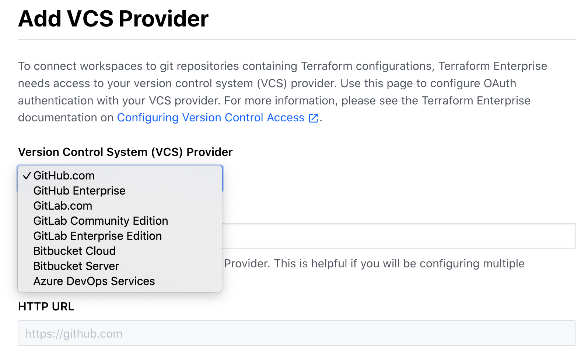
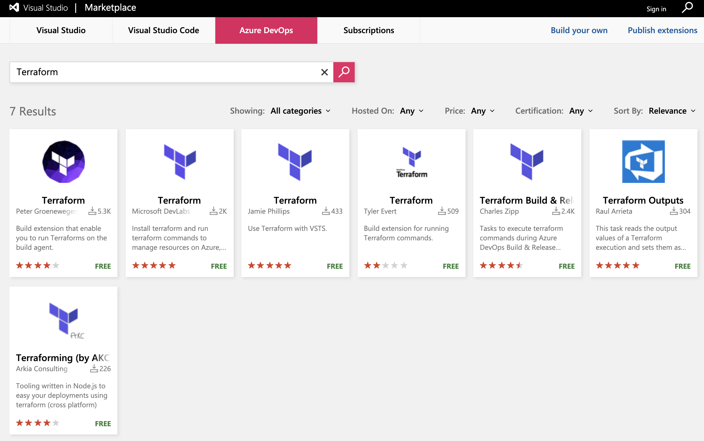
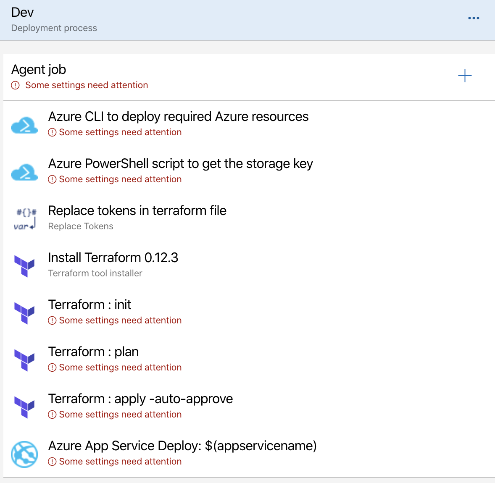

name: terraform-CICD-Azure
class: title, shelf, no-footer, fullbleed
background-image: url(https://hashicorp.github.io/field-workshops-assets/assets/bkgs/HashiCorp-Title-bkg.jpeg)
count: false

# CI/CD Pipelines with Terraform
## Azure DevOps

???
Terraform enables Infrastructure as Code for multiple public and private cloud environments.  Over the last several years, the concept of Continuous Integration and Continuous Delivery has proliferated about the Development community.  These practices and methodology are now extending to Infrastructure as Code and Immutable Infrastructure

---
layout: true

.footer[
- Copyright © 2019 HashiCorp
- 
]

---
name: terraform-slides-link
# The Slide Show
## You can follow along on your own computer at this link:
### https://git.io/JeygJ

???
Here is a link to the slides so you can follow along, but please don't look ahead!

---
name: Why CI/CD
# Why CI/CD Infrastructure
* Introduce smaller more frequent changes
* Automate testing as changes are made
* Deploy incremental updates to the system
* Tighter coordination with Development and Operations (DevOps)
Within programming, large, complex programs are broken out in to functions and reusable libraries.

???
So why bother with CI/CD.  This methodology allows us to create smaller and more frequent changes, allowing us to fail early, fail often, and easily identify the problem.

---
name: Terraform and CI/CD
# Terraform and CI/CD
.left-column[
* Version Control/Repository (git)
* Webhooks For Auto-Build/Deploy/Destroy
* Environment, Command Line, and Input Variables
* Extensive API for Workspace and Build Management
]
.right-column[
.center[]
]

???
Integration with CI/CD largely depends on the amount of code you want to do, or the level of support the CI/CD product has for Terraform.  Azure Repos are fully supported by Terraform today, and the Webhook integration is in Beta.  Several operators have done manual integrations with CI/CD platforms, mostly Jenkins.

---
name: Terraform with Azure
# Terraform and Azure
VCS Integration Complete
Some Terraform on Marketplace
Terraform actions in pipeline
.left-side[
.center[]
]
.right-side[
.center[]
]
???
Integration with CI/CD largely depends on the amount of code you want to do, or the level of support the CI/CD product has for Terraform.  Azure Repos are fully supported by Terraform today, and the Webhook integration is in Beta.  Several operators have done manual integrations with CI/CD platforms, mostly Jenkins.

---
name: Resources for Terraform and Azure CI/CD
# Terraform and Azure CI/CD
Terraform and Azure DevOps Walkthrough
https://tinyurl.com/yx6ag795

Azure DevOps Labs
https://tinyurl.com/th5ygoq

Microsoft Learn: Provision infrastructure in Azure Pipelines
https://tinyurl.com/qmnl8sm

???
Working with Azure DevOps requires a dedicated in depth conversation. There are a few resources out there to help with continuing education.
