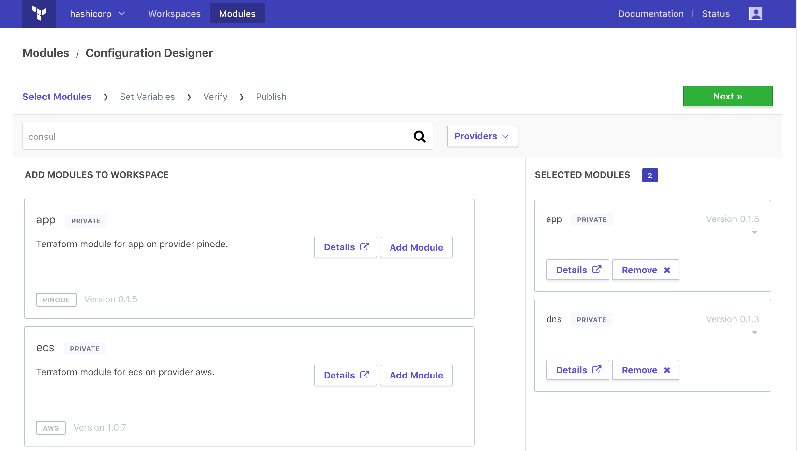

name: terraform-module-registry
class: title, shelf, no-footer, fullbleed
background-image: url(https://hashicorp.github.io/field-workshops-assets/assets/bkgs/HashiCorp-Title-bkg.jpeg)
count: false

# Terraform Modules Workshop
## Reusable Code for Scalable and Quick Infrastructure

???
This workshop provides an overview of the Terraform Module Repository Structure, how to develop modules, and how to manage modudules effectively

---
layout: true

.footer[
- Copyright © 2019 HashiCorp
- 
]

---
name: terraform-slides-link
# The Slide Show
## You can follow along on your own computer at this link:
### https://git.io/JeyeM

???
Here is a link to the slides so you can follow along, but please don't look ahead!

---
name: The Sandwich Method
# The Parts of a Sandwich
What is needed for the best sandwich?
 
.center[]
???
We're going to talk about modules in this section, but first let's talk about food.  I love food.  Sometimes too much.  Sandwiches are awesome, but what makes a sandwich?  Ask for parts of a sandwich and write them down.  Bread?  Nope, we have to start with wheat, grind the wheat down, add water.  Get down to the fundamental based of the ingredients.

---
name: Core Ingredients
# The Real Parts of a Sandwich
.left-side[
    * Flour
    * Sweetener
    * Seeds
    * Salt
    * Yeast
]
.right-side[

]
???
If we really had to start with the base ingredients for a sandwich, we would probably all starve!

---
name: What is a Module
# What is a Module
Within programming, large, complex programs are broken out in to functions and reusable libraries.
 
Infrastructure should be structured similarly, with reusable Modules.

???
Now think about Modules and your sandwich, or really any programming or problem analysis.  Modules allow you to reuse pieces that have already been designed and assembled.  Self contained packages of Terraform code that can be applied across multiple workspaces.

---
name: What is a Module - 2
# What is a Module (2)
* Abstration layer enabling easy access to bundles of resources
* Developed by HashiCorp, Community, or Internally
* Available through a private registry, or public registry (registry.terraform.io)
 
## A Module is NOT
* A thin wrapper around an existing resource
???
Modules provide an abstraction layer for Terraform operators and users to create groups of resources in a similar, predefined, method.  The Terraform registry provides thousands of modules eveloped internally or through the community.  You can even write and submit your own.  Note that private module registries are accessible to all within an organization, similar to most code repository structures.  Do not create a module simply to deploy a single resource, this is better performed using variables.

---
name: Module Details
# Module Details
Module details are available through the registry (public modules) or the Terraform UI for Private Modules
 
# Participation!
* Go to https://registry.terraform.io
* Find a module of interest
* Find the version of the module, inputs, and outputs

???
We're going to be using the public registry, however, for most instances and larger companies a private registry is more beneficial.  There may be specific resources, bundles, version, or other constraints to be defined for internal usage.  Question the students about their module and relevant information.  Open discussion about usage of private modules.

---
name: Module Details - 2
#  Module Details
Images of public and private module details
.left-side[]
.right-side[]

???
Here you can see a public module and a private module, side by side. Can you spot the differences?  Note the source.  The structure of the Private Module Repository is managed by the code repository - bitbucket in this case.

---
name: Module Structure
# Module Structure
.left-column[
* Similar to the main code, with a 'main,' 'variables,'  and 'outputs.'
* Each module should include a README describing usage
* Each module should include a version
* Most modules require input variables
* Modules can call other modules, recommended not to go more than 2 levels deep
]
.right-column[]
???
Modules are defined very similarly to core Terraform code. Actually, several people refer to the core of the Infrastructure as the 'Core Module'.  Each module should include a main tf file, a variables tf file, and an outputs file.  The readme file should include details regarding the appropriate version and necessary input variables.

---
name: Configuration Designer
# Configuration Designer
Massive time saver for infrastructure definition
* Outline a configuration for a new workspace using predefined modules
* Define versions and variables using the Terraform UI
* Generate the core module 'main.tf' to add to a new workspace and repository

???
The Configuration Designer is a huge benefit for the Private Module Registry.  Search and select modules for your infrastructure, set versions and variables, and create your main.tf.  Note that you MUST save your main.tf file off, and manually create your workspace.  You still have to do something to earn your pay.

---
name: Configuration Designer - 2
#  Configuration Designer
Images of Configuration Designer
.left-side[]
.right-side[]

???
here are some screen captures for the configuration designer, all through the Private Terraform UI.  Here is where you filter and select your modules, version, and variables, ultimately to create your main terraform file.

---
name: Configuration Designer - 3
#  Configuration Designer
Images of Configuration Designer Code Creation
.center[]

???
Ultimately you'll end up with your terraform output that you can use to create your own workspace and infrastructure.  Several large companies are doing this to make it easier to self service infrastructure.

---
name: Terraform Modules Summary
#  With Terraform Modules you can...
* Enable users to create what they need rapidly and easily
* Set boundaries around infrastructure to be deployed

Ultimately increasing agility while reducing risk and cost.

???
So, with Terraform Modules
Your users are able to create what they need, within your boundaries, rapidly without any custom scripting or point and click madness
One of the keys, is that you set the boundaries, reducing the risk not only in the parameters around that infrastructure, but you’re also dealing with known entities.
And what you end up with is a fast and controlled system that drastically reduces the cost incurred in over provisioning and waiting on the process.
