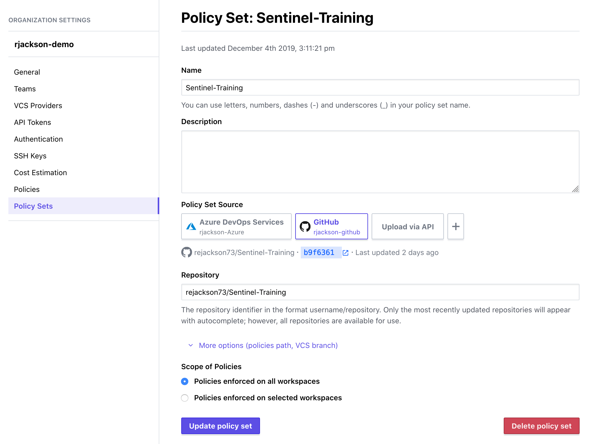
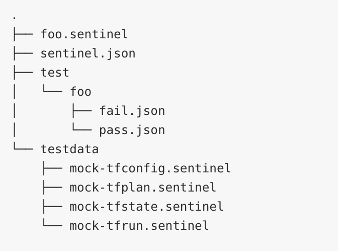

name: terraform-sentinel-intro
class: title, shelf, no-footer, fullbleed
background-image: url(https://hashicorp.github.io/field-workshops-assets/assets/bkgs/HashiCorp-Title-bkg.jpeg)
count: false

# Terraform Governance
## Guardrails For Infrastructure and Cost Protections

???
This workshop provides an overview of the uses of HashiCorp Sentinel within the Terraform Workflows.

---
layout: true

.footer[
- Copyright © 2019 HashiCorp
- 
]

---
name: terraform-slides-link
# The Slide Show
## You can follow along on your own computer at this link:
### https://git.io/Jeyzq

???
Here is a link to the slides so you can follow along, but please don't look ahead!

---
name: Need for Governance
# Safety at High Speeds
Rapid provisioning and self-service infrastructure opens up tremendous possibility, but organizations need to maintain security and prevent over provisioning.

???
You wouldn't go racing without a helmet, right?  With higher velocity and self service provisioning, maintaining security and resource management is problematic.  There is a massive amount of infrastructure waste in overprovisioning, and correction often means manual cleanup.

---
name: Traditional Governance
# Traditional Governance
.left-side[
Traditional infrastructure governance largely focused around...
* Design/Configuration Reviews
* Manual Ticketing Processes
* Periodic System Auditing
* Uncontrolled Process Documentation (if any)
]
.right-side[

]
???
Traditionally the governance was around documented processes and systematic reviews/audits that consumed time and resources.  Ticketing processes would take days, weeks, or even a month or two at times.  The value was there, but the resource impact was significant.

---
name: Traditional Governance - 2
# Governance Evolution
.left-side[
Traditional infrastructure governance largely focused around...
* Design/Configuration Reviews
* Manual Ticketing Processes
* Periodic System Auditing
* Uncontrolled Process Documentation (if any)
]
.right-side[
Continuous Integration/Delivery governance focused around...
* Version Controlled Pull Requests
* Automated Change Controls
* Prevent problems over retroactive correction
* Centralized and version controlled documentation
]
???
With programmatic policy as code, custom governance across all providers and services can be enforced at the same rate as infrastructure is provisioned.  Best practices, security, and compliance can all be codified and prevent problems before the occur.  Lastly, version control has been a staple with code development for decades.  Apply that knowledge to infrastructure to get the entire Infrastructure as Code experience.

---
name: Policy Enforcement
# Policy Enforcement
.left-side[
.center[]
]
.right-side[
.center[]
]
https://github.com/hashicorp/terraform-guides/tree/master/governance 
(https://git.io/JeyEz)

???
Policies are written in GoLang, which can result in some very complex logic.  We do have several policy rules and examples that can be pulled directly from github.

---
name: Policy Sets
# Policy Sets
.left-side[
Policies are enabled as policy sets, accessed via code repository
* Managed on an organization basis by organization owners
* Can apply to all workspaces in an organization, or selected workspaces
]
.right-side[
.center[]
]

???
Policies are grouped, usually in repositories, and configured within TFE.  The set is what is applied, but they can be as complex or simplex as possible.  They are managed per organization, but they can apply to all workspaces in an org, or select workspaces.  For example, you may want different policies for development than you do for production - same organization, two workspaces.

---
name: Policy Enforcement
# Policy Enforcement
.left-side[
Enforcement Levels
* Advisory: Warns when a policy breaks
* Soft Mandatory: Provision needs to override policy to break it
* Hard Mandatory: Provisioning not allowed to break policy
]
.right-side[
.center[]
]

???
Each policy can also be configured with its own enforcement level from a warning to a full-on smack-down.  It all depends on how the policy is defined within the configuration

---
name: Data Usage for Policies
# Policy Data
Policies can be as complex or as simple as required.  Anything in the Terraform configuration or planning output can be used as data for a policy.  You can also include values based on...
* Numerical or string variables
* Imported HTTP data
* Source Address
* Time of Day
* Code or Module versions

???
A plethora of data can be used for creating the policy, and that list keeps growing.  One new addition is to be able to call third party components via HTTP to pull back json data, and use that in the policy execution.   Each rule results in a boolean true/false, and the final decision is based on the inclusive combination of those rules.

---
name: Policy Testing
# Policy Testing
.left-column[
Policy Testing through CI/CD
* Success Criteria to validate acceptance
* Failure Criteria to validate rejections
* Mock Data to use in automated testing
]
.right-column[
.center[]
]

???
Of course if we evangelize Policy as Code, we're going to enable automated integration and deployment for those policies.  Policy repositories can include mock data and testing scenarios for positive and negative test.

---
name: Cost Estimation
# Business Based Policies
.left-side[
.center[]

]
.right-side[
.center[]
]

???
Often times, policies are driven by upper level managers or execs.  Some of these people have no idea what the difference is between a Standard D1 or a Standard A1.  What they do understand is dollars.

---
name: Azure Cost Estimation
# Azure Cost Estimation
.left-side[
Cost Estimation for Azure fairly recent
Functionality still growing with each release
]
.right-side[
.center[]
]

???
We produce releases at least once a month, and upgrading is pretty simple.  We started cost estimation with AWS, but we are working on branching that out to Azure and other clouds as well.

---
name: Terraform Governance Summary
# Terraform Governance Summary
Rapid development and deployment without manual policy review
Ensure best practices and manage infrastructure cost
Utilize cost estimation to prevent overspending
Stop problems before they happen!

https://docs.hashicorp.com/sentinel/concepts/

https://learn.hashicorp.com/terraform/sentinel/sentinel-prereqs

https://instruqt.com/hashicorp/tracks/sentinel-for-terraform

???
So with Policy and Governance
Manual speed-bumps, such as ticket reviews, to the deployment process, can be flattened, drastically increasing flexibility and velocity without sacrificing control.
Security policy and best practices are managed just like controlled documents, and are enforceable across each provider.
Over-provisioning of resources is a massive sinkhole.  Proper policies provide the protection

---
name:  Deployment Architecture
# Typical Deployment Architectures

???
Nomad utilizes a single binary application that can be run as a client or server.  It is recommended that the server cluster utilize 3-5 server nodes.  The servers communicate via the Gossip protocol, and use Consensus protocol to elect a leader.  With 3 server nodes, the cluster can sustain a single failure.  With 5 server nodes, the cluster can sustain two failures.  Note that as you increase server members, it will take longer for the consensus protocol to converge and elect a leader.

???
When servers initialize, they need to find eachother and create a leader.  A server will promote itself as a candidate to be a leader, and notify the other servers in the cluster.  

Clusters have 3-5 server nodes, required for consensus protocol to identify a server.  Leader elected by server nodes through consensus, using Raft.  3 Server nodes can sustain a single failure.  5 Server nodes can sustain two failures.

Transactions recorded at the server are durable - written to majority of servers before acknowledged.

Each Cluster belongs in region, although a region could cross multiple data centers.

Servers in each region are part of a single consensus group, so there is an elected leader in that group.
consensus provides leader election and durable state replication

Servers participate in Gossip protocol for discovery.  Within a single region, Servers use Gossip to discover eachother and participate in Consensus
Gossip does simple clustering and multi-region federation

when an agent initializes, it reaches out to the configured servers, either address, FQDN, or preferrably using Consul service discovery
Nomad with Consul
Nomad doeas a lot for auotmatic discovery of servers, and client discovery of servers.  OThere are no strict requirements on the saervers coming or going, so if a server fails it can be replaced without much effort.  Wouldn't it be nice if the new server could be auto discovered, and auto discover, the cluster using Consul service discovery?

ACL tokens, policies, and Sentinel policies are shared among regions.  Data is not shared across regions

If an entire region level server cluster fails, clients can still submit jobs to another region - multi-region federation

Servers can be manually join in a cluster, once one of the servers is up and ready (bootstrapped)

Bootstrap the cluster using Consul - also get service availabilty through consul

Federation
Need RPC and Serf across regions
Join the servers by pointing to another region - another good use for Consul
Once regions are joined, Gossip enables discovery of other servers

