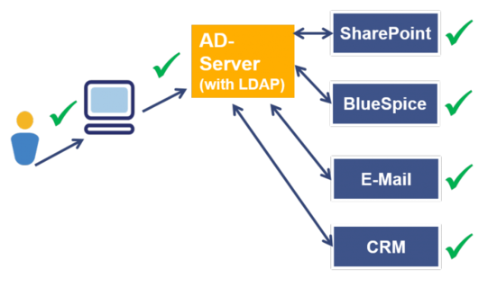
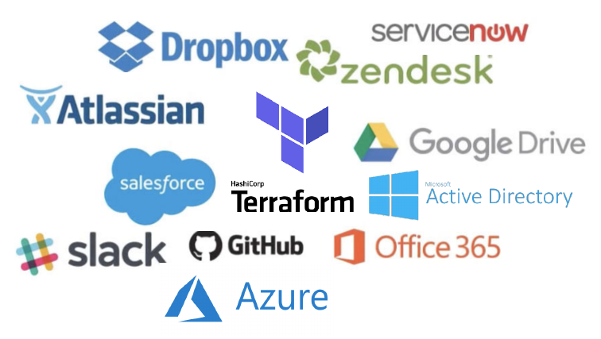
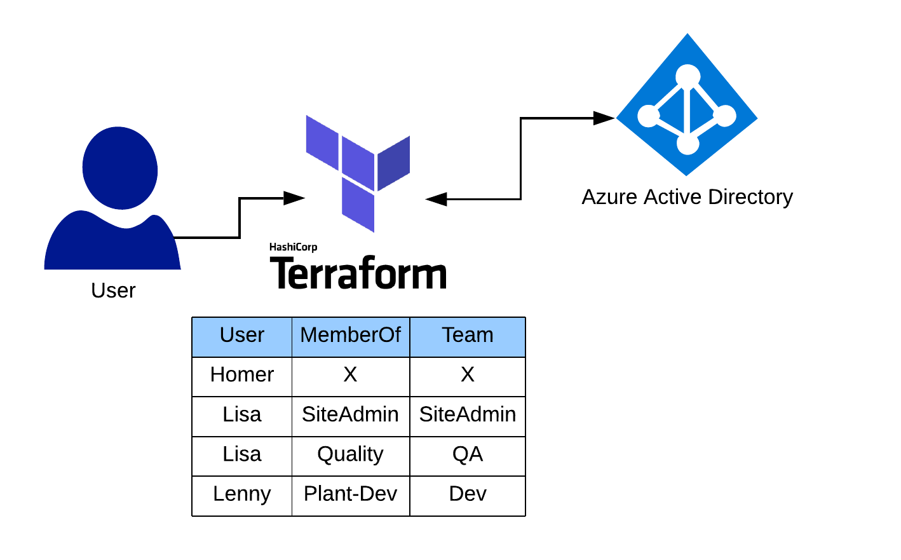
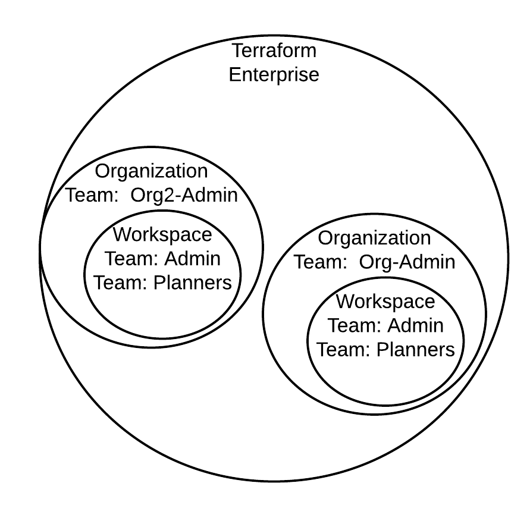
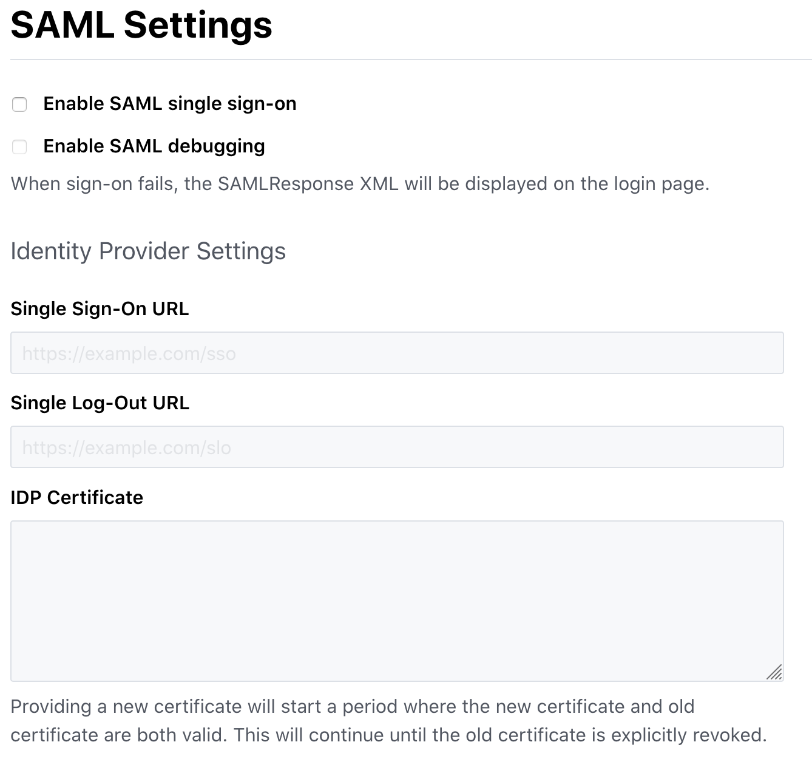
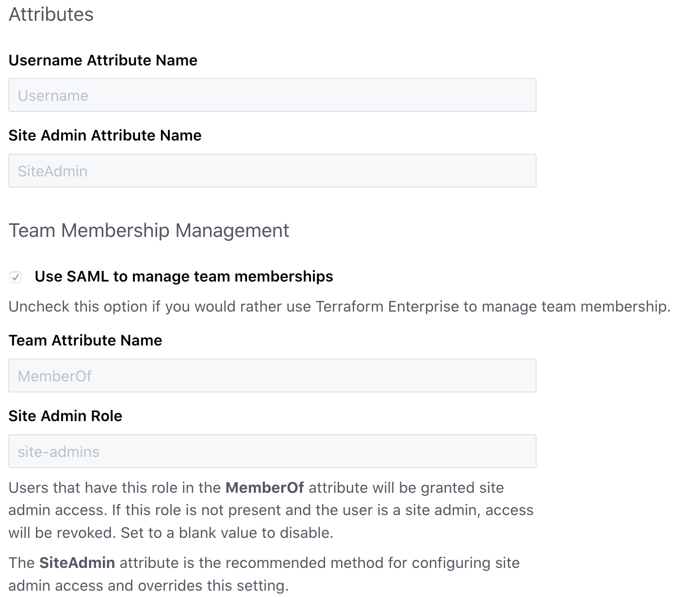

name: terraform-user-management
class: title, shelf, no-footer, fullbleed
background-image: url(https://hashicorp.github.io/field-workshops-assets/assets/bkgs/HashiCorp-Title-bkg.jpeg)
count: false

# Terraform User Management
## Access, Permissions, and Integrations

???
Of course any tools or utilities introduced to an enterprise environment requires some sort of single signon user managemnet.  Let's talk about how Terraform helps with this administration necessity.

---
layout: true

.footer[
- Copyright © 2019 HashiCorp
- 
]

---
name: terraform-slides-link
# The Slide Show
## You can follow along on your own computer at this link:
### tbd

???
Here is a link to the slides so you can follow along, but please don't look ahead!

---
name: User Management History
# Corprate Account Management
LDAP/Active Directory Since '90s
* Authentice Users on Workstations
* Authenticate for e-mail/CRM/Intranet
* Focused on on-prem application

???
Some may remember single sign on for corprate environments.  I logged into my Windows Workstation, which authenticated me against Active Directory.  That gave me access to email, and usually the Intranet.  This is great for on-prem authentication.  Sometimes I hated it, but it was nice not having different credentials for each internal service.

---
name: Credential Proliferation
# So Many Passwords!

Today's Web-Based Landscape

???
Now we extend the LDAP and single sign-on functionality to distributed webapps.  Each of these services requires credentials, with complex passwords.  This is the reason why password managers exist!  Do we really want to add more utilitites with individual credential management?

---
name: Terraform Login
# Terraform Login

???
The Security Assertion Markup Language has been around since the early 2000s, and facilitates single sign-on across web applications.  Terraform fully supports SAML 2.0 with attribute matching.  Any Identity Provider that supports SAML can perform authentication, and Attribute Matching provides Authorization

---
name: Terraform Teams
# Terraform Teams - User Role Definition
.left-column[
    Per Organization
    * Manage Policies (Sentinel)
    * Manage Workspaces
    * Manage VCS Connections
     
    Per Workspace
    * Read/Plan/Write/Admin
]
.right-column[

]
???
User Teams can be managed on an organization level, or at an individual workspace level.  Organizational level teams are focused more around infrastructure management and governance, while workspace is focused around contributions and creations.

---
name: Terraform SAML Integration
# Terraform Teams - User Role Definition
.left-side[

]
.right-column[

]
???
SAML configuration is pretty simple, through the TFE administration interface.  This is also where you'll associate attributes with specific teams.

---
name: Terraform SAML Integration
# Documented Terraform SAML Examples
Available documentation on the website for various SAML integrations including...
* Active Directory Federated Services (ADFS)
* Azure Active Directory
* OKTA
* OneLogin

## Documentation at https://tinyurl.com/sozcu9t
???
So HashiCorp has really worked to make adoption of Terraform as simple as possible...the User Management functions is just another example.