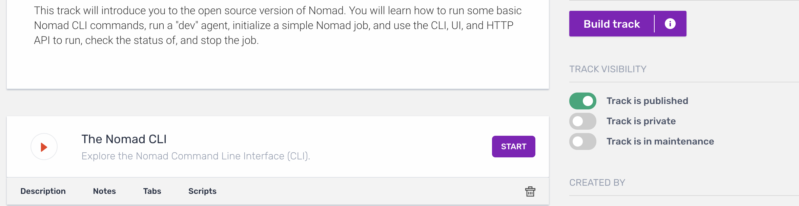

name: Instruqt and Remark Overview
class: title, shelf, no-footer, fullbleed
background-image: url(https://hashicorp.github.io/field-workshops-assets/assets/bkgs/HashiCorp-Title-bkg.jpeg)
count: false

# Intruqt and Remark
## Tools for Demos, Training, and Workshops

.center[]

???
Quick slide deck describing how we are using Instruqt and Remark

---
name:  Slide Deck
# Follow along
.center[(https://git.io/JvtEs)]
.center[But don't look ahead!]

.center[Content Source (https://git.io/JvtEc)]

---
class:
name:  Tool Introduction

# What are these Tools?

.smaller[
| Instruqt            | Remark                 |
|-------------------------------|-------------------------------------------------|
|Web based learning platform enabling 'real world' simulation through dynamic resources | Markdown based slideshow tool completely browser based  |
| Configured and managed through YAML enabling version control in Github | Utilizes a combination of html and javascript for presentations
| Spins up resources on demand for shell and browser based access | Viewable on virtually any device including mobile
| www.instruqt.com | www.remarkjs.com |
]
.smaller[
.center[[Intruqt and Remark Contributor Guide](
https://hashicorp.atlassian.net/wiki/spaces/SE/pages/511574174/Instruqt+and+Remark+Contributor+Guide)]]
.smaller[
.center[[Slack Channel #proj-instruqt](https://hashicorp.slack.com/archives/CGYB4R3NX)]]
.smaller[.center[https://github.com/hashicorp/field-workshops-"product"]
]

???
HashiCorp has selected Instruqt for the interactive learning and education, and Remark for the presentation materials for the presentations.  Both platforms embrace the 'as code' mentality, enabling us to use Github for source and version control.

---
class:
Name: Starting-With-Instruqt
# Starting with Instruqt
* Uses Topics, Tracks, and Challenges
    * Topics are Product based (Terraform/Vault/Consul/Nomad)
    * Tracks are Product Usage (Terraform on Azure)
    * Challenges are specific problems within Tracks
* HashiStack spun up as VM/container images - Shell and UI Accessible via Browser if configured
* Instructions Embedded in Presentation
.center[[Getting Started with Instruqt](https://instruqt.com/public/tracks/getting-started-with-instruqt)]

???
This presentation isn't intended to be an in depth analysis of Instruqt, but rather an introduction.  Instruqt uses Topics, Tracks, and Challenges to educate participants.  Challenges have an associated test that prevents people from just clicking through.  Roger and Sean setup the system with hashistack image to allow people to use the tools without installing them.  If you want to walk through Instruqt, hit the URL here, but not until after we're doine.

---
class:
Name: Track-Components
# What Lies Beneath?

Each Instruqt **Track** consists of two main files; config.yml and track.yml
.smaller[
* config.yml specifies the overall environment for the Track (machine parameters and image)
* track.yml specifies the contents of the **Track**, with each task/operation in a Track referred to as a **Challenge**]

Operationally, the Track can include...
.smaller[
* Scripts or commands to setup the services
* "check" file describes how to confirm student executed program
* "solve" file enabling automatic testing of the track]

???
There aren't a lot of pieces to Instruqt.  The configuration yaml file includes the image, shell, machine type, and a name for the server.  The track yaml file has the details of full course, and all Challenges.  Description, notes, tabs, and much, much more.  This is really the meat of the solution.

Optionally, you can have "setup," "check," and "solve" files.  The setup runs any scripts or services not in the AMI (so this shouldn't happen often).

---
class:
name: HashiCorp-On-Instruqt
# HashiCorp on Instruqt

.center[https://instruqt.com/hashicorp]
.center[]
.center[Login using GSuite Credentials]

???
We have our own private and public tracks on Instruqt.  Anybody can use the public Instruqt tracks, and if you create a free account Instruqt will save progress as you go through tracks.  As HashiCorp employees we have access to private tracks, or tracks in development, and can contribute to the tracks

---
class:
Name: Access-Private-Tracks
# Access to Private Tracks

Students can be invited to private tracks
* With great power comes great responsibility
* URL Provided which can be sent to students
* **Strongly** recommend expirations on Invites

.center[]

???
You can invite people to private tracks.  You can make your own and just keep it for your invitees!  Not recommended though.  Keep in mind that some private tracks are still in development and may change.  Always good to set an expiration for the link as well as the track itself

---
class:
Name: Sending-Invitations
# Invitations

.center[]

???
Once you select a new invite, you can populate the parameters.  Lots of information here but not all is required. After the invitation is saved, the user has access to the URL to distribute

---
class:
Name: things-to-watch-out-for
#  Be Aware of...
* Challenges and tracks do time out.
* Sometimes tracks get 'stuck'
* Alert #proj-instruqt and #se-workshops whenever a workshop is planned

???
Timeout for each challenge is 5-10 minutes, configured in the track.yml file.  If you don't have an account, you will lose Track progress
Best way to "unstick' a track is to restart the challenge, or the entire track
People are there to support/help, just let them know in advance!

---
class: img-right
Name:  modifying-tracks
# Modifying Tracks

.smaller[
* Track information kept in Github and Instruqt (no auto-sync)
* Tracks can be built/edited via UI or CLI using [Instruqt SDK](https://docs.instruqt.com/#introduction)
* Similar to Github, Tracks are retrieved and pushed to Instruqt, with an option to test
.smaller[
* `instruqt track pull`
* `instruqt track test`
* `instruqt track push`
]
]
Note:  Pushing to Instruqt will NOT push to Github!

???
Content posted to Instruqt and Github - there is no way to sync the two items yet.
Recommendation:  Start the tracks using the UI, put together the framework.  Then build out the content using Text/Command line

Basically, once the SDK is installed, you can pull the track, run tests of the track (using checks and solves) and push the track to Instruqt.  You still need to check changes into Github for Source Control!

---
class:
name: checks-and-solves
# Checks and Solves
"Checks" are used to check students along the path (shocking)
* `grep -q "nomad agent -dev -bind=0.0.0.0 &" /root/.bash_history || fail-message "Start Nomad Before Continuing"`

"Solves" are used to script student reactions
* `echo -e "nomad node status" >> /root/.bash_history; nomad node status`

???
Checks are used to basically make sure people aren't just clicking through the Track, providing a way to 'check' their work.  Essentially a bash script that can simply check bash history is sufficient

A Solve basically simulates user behavior, allowing the Track to run through an automated test without human intervention.

---
name: remark-start
class: title, shelf, no-footer, fullbleed
background-image: url(https://hashicorp.github.io/field-workshops-assets/assets/bkgs/HashiCorp-Title-bkg.jpeg)
count: false
# And Now on To Remark
## Simple Browser Based Slideshows

???
Hopefully that was enough on Instruqt, now lets move onto Remark

---
class:
name: markdown-introduction
# What is Markdown?
* File based presentation method
* Utilizes Markdown for content, HTML and CSS for browser presentation
* Enables use of Github for version control and community contributions!
    * For a review of Github, check out [This Presentation](https://docs.google.com/presentation/d/1fF4kIegqpzDgTQj73Z7CL_6MT-4tJkjqSvCay-fbXjA/edit)

.center[More on Remark with this [Remark Presentation](https://remarkjs.com/#1) and [Github Repo](https://github.com/gnab/remark)]

???
File based presentation method Using Markdown, CSS and HTML
Allows us to use Github for version tracking, reviews, contributions.  We should all be familiar with Github by now.  If not, there is a decent presentation on using github out there.
There is a very brief introduction to Remark available, along with the corresponding repo so you can see the source.

---
class:
name:  slide-creation
# Creating Remark Slides

Not as full featured or intuitive as Google Slides, Keynote, Powerpoint, etc.

* No animation
* Images, columns, and tables are possible
* Using Apron and Adirondack, and Descartes themes
    * Refer to nice [Adirondack presentation](https://story.xaprb.com/slides/adirondack/#p1) as well as [source code](https://raw.githubusercontent.com/xaprb/story/master/exampleSite/content/slides/adirondack/index.md) for help

Creation requires only a text editor, and viewing requires only a browser!

???
There are some limitations to Remark, and minor complications.
For starters, there isn't anything like animation, but seriously, don't use animation anyway.  Just don't
Columns, tables, image placements are possible, it just takes a bit more than a 'point and click'.  Running locally really helps with formatting tweaks.

---
class:
name:  slide-creation-2
# More on Content Development

* Changes to HTML can add features, but not recommended
    * Helpful if we all use the same base CSS
* When collaborating, share repository and presentation links!
* Local view using Python
    * `python3 -m http.server` from content directory
    * Point browser to `http://localhost:8000`

???
You can tweak and add more features and functionality, but baselining on the HTML just makes sense for collaboration.
On the topic of collaboration, always share the presentation link, as well as the github source so people can see how the content is presented.
Viewing the presentation as you build is really helpful as well.  Run the presentation locally using python and a simple HTTP server, and directing your browser to the localhost/port.

---
class:
name: presenting
# Presenting Using Remark

Provide easy access using git.io URL shortening
* While presenting...
.smaller[
    * `h` for help screen
* `c` to clone to synchronized windows
* `p` to view presenter notes
.left[and much much more!]
]
.center[Fork and Customize! (requires setting up Github Pages)]

???
When presenting, it's always nice to share a URL so people can follow along on their own, and refer to the presentation in the future.  If the presentation is updated, they get access to the updates!
These are some very useful commands while presenting.  Of course you can always hit 'h' for help, but cloning opens up a second synchronized window, so you can then open presenter view on one of the screens.
I highly recommending forking the repository and customizing the content.  this is a great way to put the speaker notes in your own words.

---
class:
name: Github Pages Reference
# Github Pages

.left[]
.center[]
???
If you want to present from your own repo, make sure you host the repository on github pages.  This isn't that tough...just go to the repo settings, and enable github pages for that repo.

---
name: thanks
class: title, shelf, no-footer, fullbleed
background-image: url(https://hashicorp.github.io/field-workshops-assets/assets/bkgs/HashiCorp-Title-bkg.jpeg)
count: false
# Thank You!